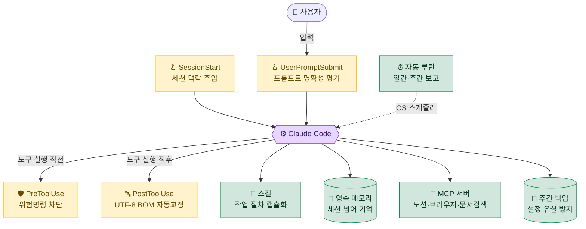

<div align="center">

# 🛠️ Claude Code 실전 셋업 툴킷

**6개월 인턴 실무에서 매일 쓰며 다듬은 Claude Code 설정 · 훅 · 스킬 · 자동화 모음**

_단순 "이렇게 하세요"가 아니라 — **무엇을 / 왜 썼고 / 무엇이 좋아졌는지**까지._


### 🌐 [웹으로 보기 — 문서 사이트 바로가기](https://ckddn0221-cpu.github.io/Claude-code-toolkit/)

사이드바·검색·다이어그램이 있는 웹 문서로 따라 하기 편합니다. (저장소 markdown을 그대로 렌더 — 단일 소스)

</div>

---

> [!NOTE]
> 이 저장소는 특정 회사·프로젝트 코드가 아니라, **누구나 자기 환경에 그대로 옮겨 쓸 수 있는 일반화된 셋업 패턴**만 담았습니다.
> 개인 경로·자격증명·내부 식별자는 모두 placeholder(`<...>`)로 치환했습니다.

## 📑 목차

- [전체 그림 한 장](#-전체-그림-한-장)
- [한눈에 보기](#-한눈에-보기)
- [왜 이런 셋업인가 — 설계 원칙 3가지](#-왜-이런-셋업인가--설계-원칙-3가지)
- [도입 순서 & 체감 효과](#-도입-순서--체감-효과)
- [디렉토리 구조](#-디렉토리-구조)
- [적용 전 주의 (보안)](#-적용-전-주의-보안)
- [라이선스 / 출처](#-라이선스--출처)

---

## 🗺️ 전체 그림 한 장

훅이 Claude Code를 감싸 **안전·맥락**을 자동화하고, 스킬·메모리·MCP가 **능력·기억·연결**을 확장하고, 자동 루틴·백업이 **반복·보존**을 맡습니다.



---

## 👀 한눈에 보기

| 영역 | 무엇 | 핵심 이득 | 문서 |
|---|---|---|---|
| 🪝 **훅** | 세션·도구 실행 전후에 끼어드는 자동 스크립트 6종 | 위험 명령 차단, 한글 깨짐 자동 교정, 세션 맥락 주입, caveman `ultra` compact 후 유지 | [01-hooks](docs/01-hooks.md) |
| 🧩 **스킬** | 작업별 전문 절차를 캡슐화한 모듈 (직접 14종 + 번들) | "PPT 만들어줘" 한마디로 검증된 절차 적용 | [02-skills](docs/02-skills.md) |
| 🧠 **메모리** | 파일 기반 영속 기억 시스템 | 세션이 바뀌어도 취향·결정·맥락 유지 | [03-memory](docs/03-memory.md) |
| ⏰ **자동 루틴** | 정해진 시간에 도는 보고/정리 작업 | 일간·주간 보고 자동, 메모리 자동 정리 | [04-automation](docs/04-automation.md) |
| 🔌 **MCP 서버** | 외부 도구 연결(노션·브라우저·문서검색) | Claude가 실제 외부 시스템 직접 조작 | [05-mcp](docs/05-mcp.md) |
| 🗜️ **caveman** | 토큰 압축 응답 모드 | 같은 작업을 더 적은 토큰으로 | [06-caveman](docs/06-caveman.md) |
| ⚙️ **설정·백업** | `settings.json` · 상태줄 · 주간 백업 | 환경 재현성, 설정 유실 방지 | [07-settings-backup](docs/07-settings-backup.md) |
| 🔄 **양 머신 동기화** | 회사 Windows ↔ 집 Mac 설정 일치 | 어느 컴퓨터에서 켜도 같은 환경 | [08-sync-infra](docs/08-sync-infra.md) |
| 🤖 **멀티에이전트** | 작업을 여러 에이전트로 분산·검증 | 대규모 리뷰/리서치/마이그레이션 병렬 | [09-workflows](docs/09-workflows.md) |
| 🧩 **플러그인·마켓플레이스** | 플러그인/마켓플레이스 설치·관리 | 도구를 묶음으로 켜고 끄기 | [10-plugins-marketplaces](docs/10-plugins-marketplaces.md) |
| 🗺️ **전체 인벤토리** | 무엇이 담기고 무엇이 빠졌나 (커버리지 맵) | "전부 담겼나"에 대한 답 | [11-inventory](docs/11-inventory.md) |

> [!TIP]
> 처음이라면 → **[00. 빠른 시작](docs/00-quickstart.md)** 부터 보세요. 10분이면 핵심 3개를 켤 수 있습니다.

---

## 💡 왜 이런 셋업인가 — 설계 원칙 3가지

Claude Code는 기본만 써도 강력하지만, **반복 업무·실수 방지·맥락 유지**는 직접 손봐야 합니다.

<table>
<tr>
<td width="33%" valign="top">

### 1️⃣ 실수는 시스템이 막는다

사람의 주의력에 기대지 않습니다. 위험한 삭제·강제 푸시는 **훅이 자동 차단**, 한글 인코딩 깨짐은 **저장 시 자동 교정**.

</td>
<td width="33%" valign="top">

### 2️⃣ 맥락은 기억하게 만든다

매번 "나는 이런 사람이고 이 프로젝트는…"을 다시 설명하지 않도록 **메모리·CLAUDE.md·세션 훅**으로 자동 주입.

</td>
<td width="33%" valign="top">

### 3️⃣ 반복은 자동화한다

일간/주간 보고, 메모리 정리, 설정 백업을 **OS 스케줄러에 위임**. 안 하면 서서히 망가지는 일을 시스템에.

</td>
</tr>
</table>

---

## 🚀 도입 순서 & 체감 효과

> 위에서부터 차례로. 앞 3개만 켜도 체감이 확 바뀝니다.

| 순서 | 항목 | 체감 효과 | 난이도 | 문서 |
|:---:|---|:---:|:---:|---|
| 1 | CLAUDE.md 글로벌 지침 | ⭐⭐⭐ | 🟢 쉬움 | [00](docs/00-quickstart.md) |
| 2 | 위험명령 차단 훅 | ⭐⭐⭐ | 🟢 쉬움 | [01](docs/01-hooks.md) |
| 3 | 메모리 시스템 | ⭐⭐⭐ | 🟡 중간 | [03](docs/03-memory.md) |
| 4 | UTF-8 BOM 훅(한글 Windows) | ⭐⭐ | 🟢 쉬움 | [01](docs/01-hooks.md) |
| 5 | 세션 컨텍스트 훅 | ⭐⭐ | 🟡 중간 | [01](docs/01-hooks.md) |
| 6 | 스킬 설치 | ⭐⭐ | 🟢 쉬움 | [02](docs/02-skills.md) |
| 7 | 자동 보고·백업 | ⭐⭐ | 🟡 중간 | [04](docs/04-automation.md) · [07](docs/07-settings-backup.md) |
| 8 | MCP 연결 | ⭐⭐ | 🟡 중간 | [05](docs/05-mcp.md) |
| 9 | caveman 토큰 압축 | ⭐ | 🟢 쉬움 | [06](docs/06-caveman.md) |
| 10 | 양 머신 동기화 | ⭐ | 🔴 어려움 | [08](docs/08-sync-infra.md) |

---

## 📁 디렉토리 구조

```
claude-code-toolkit/
├── README.md                 # 이 파일 — 전체 지도
├── docs/                     # 영역별 상세 문서 (왜 / 무엇 / 장점)
│   ├── 00-quickstart.md      #  ↳ 10분 빠른 시작
│   ├── 01-hooks.md           #  ↳ 훅 6종 — 안전장치
│   ├── 02-skills.md          #  ↳ 스킬 — 작업 절차 캡슐화
│   ├── 03-memory.md          #  ↳ 영속 메모리 시스템
│   ├── 04-automation.md      #  ↳ 자동 보고·정리 루틴
│   ├── 05-mcp.md             #  ↳ 외부 시스템 연결
│   ├── 06-caveman.md         #  ↳ 토큰 압축 모드
│   ├── 07-settings-backup.md #  ↳ 설정·상태줄·백업
│   ├── 08-sync-infra.md      #  ↳ 양 머신 동기화 패턴
│   ├── 09-workflows.md       #  ↳ 멀티에이전트 오케스트레이션
│   ├── 10-plugins-marketplaces.md # ↳ 플러그인 & 마켓플레이스
│   └── 11-inventory.md       #  ↳ 전체 인벤토리 & 커버리지 맵
└── examples/                 # 복붙해서 바로 쓰는 산티타이즈 예제
    ├── settings.json         # 훅·플러그인·상태줄 등록 예시
    ├── CLAUDE.md.example     # 글로벌 지침 템플릿
    ├── backup-claude-settings.ps1 # 주간 백업 스크립트
    ├── hooks/                # 훅 스크립트 6종
    └── scheduled-tasks/      # 자동 루틴 정의 예시
```

---

## 🔐 적용 전 주의 (보안)

> [!WARNING]
> - 이 저장소의 예제에는 **실제 토큰·노션 ID·구글시트 ID·회사/프로젝트명이 전혀 없습니다.** 본인 환경에 옮길 때 `<...>` placeholder만 채우세요.
> - 자격증명(`~/.claude/.credentials.json`, MCP 토큰)은 **절대 git에 커밋하지 마세요.** 머신마다 최초 로그인으로 발급받는 것이 정석입니다.
> - 훅은 임의 코드를 실행합니다. 남의 훅을 그대로 쓰기 전에 **내용을 읽고 이해하세요.**

---

## 📜 라이선스 / 출처

- 라이선스: **[MIT](LICENSE)** — 직접 작성한 훅·문서·설정 예제는 자유롭게 가져다 쓰세요.
- 외부 플러그인/스킬(예: [`caveman`](https://github.com/JuliusBrussee/caveman))은 각 출처의 라이선스를 따릅니다. 문서에 출처를 명시했습니다.

<div align="center">

---

**[📖 빠른 시작으로 →](docs/00-quickstart.md)**

</div>
