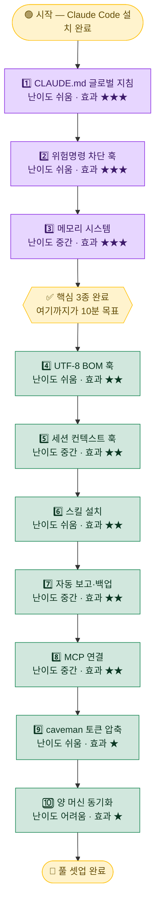

# 🚀 00. 빠른 시작

Claude Code를 처음 깔았거나, 이 툴킷을 자기 환경에 옮기려는 사람을 위한 **최소 경로**입니다. 전부 다 켤 필요는 없습니다. 위에서부터 순서대로, **앞 3개만 켜도 매일의 체감이 확 바뀝니다.**

> [!NOTE]
> 이 문서는 "무엇을 어떤 순서로 켜면 가장 빠르게 효과를 보는가"에만 집중합니다. 각 항목의 상세 원리·옵션·실패 사례는 링크된 개별 문서에서 다룹니다. 여기서는 **10분 안에 핵심 3개를 켜는 것**이 목표입니다.

---

## 🧭 전체 흐름 한눈에

아래 순서는 **체감 효과가 큰 것 → 작은 것**, **쉬운 것 → 어려운 것** 순으로 정렬되어 있습니다. 숫자가 작을수록 먼저 켜는 것을 권장합니다.



> [!TIP]
> 위 다이어그램에서 **보라색(1~3)** 이 "꼭 켜야 하는 핵심"이고, **초록색(4~10)** 은 "필요할 때 하나씩 추가"입니다. 노란색 게이트(`핵심 3종 완료`)까지만 도달해도 일상 작업의 대부분이 개선됩니다.

---

## 0️⃣ 전제

시작 전에 아래 두 가지만 확인합니다.

- [Claude Code](https://claude.ai/code) 설치 완료
- 글로벌 설정 폴더 위치 확인

| OS | 글로벌 설정 폴더 경로 | 예시 |
|---|---|---|
| 🪟 **Windows** | `%USERPROFILE%\.claude\` | `C:\Users\<USER>\.claude\` |
| 🍎 **macOS** / 🐧 **Linux** | `~/.claude/` | `/home/<USER>/.claude/` |

> [!IMPORTANT]
> 이 폴더는 Claude Code가 **모든 프로젝트에 공통으로 읽어 들이는 글로벌 영역**입니다. 앞으로 나오는 `~/.claude/...` 경로는 전부 이 폴더 기준입니다. 폴더가 아직 없다면 Claude Code를 한 번 실행하면 자동 생성됩니다.

<details>
<summary>📂 폴더가 안 보이거나 경로를 모를 때</summary>

- Windows 탐색기 주소창에 `%USERPROFILE%\.claude` 를 그대로 붙여넣으면 바로 열립니다. (`.`으로 시작하는 폴더는 숨김 처리될 수 있으니 "숨김 항목 표시"를 켜세요.)
- PowerShell에서는 다음으로 경로를 확인할 수 있습니다.

```powershell
echo "$env:USERPROFILE\.claude"
```

- macOS/Linux 터미널에서는 다음과 같습니다.

```bash
echo ~/.claude
```

</details>

---

## 1️⃣ 가장 먼저 — 글로벌 지침(CLAUDE.md)

`~/.claude/CLAUDE.md` 에 **"나는 누구이고, 어떻게 답해줬으면 좋겠는지"** 를 적습니다. 이 파일은 모든 세션에 자동으로 주입되는 시스템 프롬프트 역할을 합니다.

→ [examples/CLAUDE.md.example](../examples/CLAUDE.md.example) 복사 후 본인에 맞게 수정하세요.

```bash
# 예시: 템플릿을 글로벌 위치로 복사 (경로는 본인 환경에 맞게)
cp <repo>/examples/CLAUDE.md.example ~/.claude/CLAUDE.md
```

**효과**: 매 대화마다 "한국어로 답해줘", "내 환경은 Windows야"를 반복할 필요가 없어집니다. 한 번 적어두면 모든 세션이 그 맥락 위에서 시작합니다.

> [!TIP]
> 처음부터 완벽하게 쓰려 하지 마세요. **언어·OS·답변 톤** 세 줄만 적어도 충분히 효과적입니다. 쓰다 보면 "이건 매번 설명하네" 싶은 것이 보이는데, 그때마다 한 줄씩 추가하는 방식이 가장 오래갑니다.

<details>
<summary>✍️ 어떤 것을 적으면 좋은가 — 예시 항목</summary>

- **언어**: "모든 자연어 출력은 한국어로."
- **환경**: "Windows 10, PowerShell 5.1, 한글 경로 혼재."
- **응답 스타일**: "짧고 명확하게, 불필요한 자평 금지."
- **역할/배경**: "나는 컴퓨터 비전 백그라운드의 주니어 개발자."
- **금지 사항**: "비가역 작업(삭제·강제 푸시)은 먼저 확인받을 것."

이 항목들은 곧 등장할 **메모리 시스템(3번)** 과 함께 쓰면 효과가 배가됩니다. CLAUDE.md는 "변하지 않는 나의 기본값", 메모리는 "프로젝트별로 쌓이는 결정"을 담당합니다.

</details>

---

## 2️⃣ 훅 1개만 먼저 — 위험 명령 차단

가장 체감 큰 훅부터 켭니다. `rm -rf`, `git push --force`, `git reset --hard` 같은 **비가역 명령을 자동 차단**합니다. 사람의 주의력에 기대지 않고, 실행 직전에 시스템이 막아주는 방식입니다.

→ [examples/hooks/guard-dangerous-bash.ps1](../examples/hooks/guard-dangerous-bash.ps1) (Windows)
→ `~/.claude/settings.json` 의 `PreToolUse` 훅으로 등록 ([07-settings-backup.md](07-settings-backup.md) 참고)

> [!WARNING]
> 훅은 **임의 코드를 실행**합니다. 남이 만든 훅 스크립트를 그대로 등록하기 전에, 반드시 **내용을 직접 읽고 무엇을 차단/허용하는지 이해**하세요. 이 툴킷의 예제 훅도 마찬가지입니다.

> [!CAUTION]
> 이 훅은 "안전망"이지 "완벽한 방어선"이 아닙니다. 패턴 매칭 기반이라 변형된 명령(예: 경로를 변수로 우회)까지 모두 막지는 못합니다. **위험 작업은 여전히 사람이 한 번 더 확인**하는 습관과 병행하세요.

<details>
<summary>🛡️ 왜 첫 훅으로 "위험 명령 차단"을 권하는가</summary>

- **복구 불가능한 사고를 막아주기 때문**입니다. 오타 한 번(`rm -rf .` vs `rm -rf ./tmp`)이 돌이킬 수 없는 결과로 이어지는 것을 0번의 비용으로 예방합니다.
- 설정이 단순합니다. `PreToolUse` 한 곳에 스크립트 하나만 연결하면 됩니다.
- 효과가 즉각적입니다. 등록 직후 다음 세션부터 바로 작동합니다.

훅 전반(세션 시작 훅, 저장 후 자동 교정 훅 등)은 → [01-hooks.md](01-hooks.md) 에서 5종을 통째로 다룹니다.

</details>

---

## 3️⃣ 메모리 켜기

`~/.claude/projects/<프로젝트>/memory/MEMORY.md` 인덱스를 만들면, Claude가 **세션을 넘어 사용자 취향·결정을 기억**합니다. 어제 내린 결정, 프로젝트의 제약, 반복되는 라우팅 규칙을 매번 다시 설명하지 않아도 됩니다.

→ [03-memory.md](03-memory.md)

> [!TIP]
> 메모리는 "큰 문서 하나"가 아니라 **인덱스(MEMORY.md) + 짧은 주제별 파일**로 운영하는 것이 핵심입니다. 인덱스에는 각 메모리의 한 줄 요약만 두고, 상세는 별도 파일로 분리하면 컨텍스트를 절약하면서도 필요할 때 정확히 찾아 읽을 수 있습니다.

<details>
<summary>🧠 메모리에 무엇을 적고, 무엇을 적지 말아야 하나</summary>

**적으면 좋은 것**

- 반복되는 결정 (예: "배포 모델은 X로 확정", "라이브러리는 permissive 라이선스만")
- 프로젝트 고유 제약 (경로, 데이터셋 호칭 규칙, 외부 시스템 ID 등)
- 사용자 정정 패턴 (라우팅이 어긋났을 때의 올바른 분류)

**적지 말아야 할 것**

- 자격증명·토큰·긴 해시 ID (메모리는 평문 파일입니다)
- 자주 바뀌는 휘발성 상태 (오늘의 작업 진행률 등 — 일일 보고로)

> [!IMPORTANT]
> 메모리 파일이 git으로 동기화되는 환경이라면, **개인정보·내부 식별자가 평문으로 커밋되지 않도록** 주의하세요. 공개 저장소에 올릴 때는 placeholder(`<...>`)로 치환하는 것이 안전합니다.

</details>

---

## 4️⃣ 필요한 스킬만 설치

PPT·문서·시각화 등 **자주 하는 작업**이 있으면 해당 스킬을 `~/.claude/skills/` 에 둡니다. 스킬은 "검증된 작업 절차"를 캡슐화한 모듈이라, 한마디 지시로 일관된 결과를 얻을 수 있습니다.

→ [02-skills.md](02-skills.md)

> [!TIP]
> 모든 스킬을 한꺼번에 깔 필요는 없습니다. **실제로 자주 하는 작업부터** 하나씩 추가하세요. 안 쓰는 스킬이 많아지면 오히려 어떤 스킬이 언제 발동되는지 파악이 어려워집니다.

---

## 5️⃣ (선택) 자동 보고·백업

매일/매주 도는 보고나 설정 백업을 **OS 스케줄러에 등록**합니다. "안 하면 서서히 쌓이는 일"을 시스템에 위임하는 단계입니다.

→ [04-automation.md](04-automation.md), [07-settings-backup.md](07-settings-backup.md)

> [!NOTE]
> 자동화는 "핵심 3종"을 충분히 써보고 **자신만의 루틴이 안정된 뒤**에 도입하는 것이 좋습니다. 아직 설정이 자주 바뀌는 초기에 스케줄러부터 걸면, 바뀐 설정과 자동 루틴이 어긋나 디버깅만 늘어납니다.

> [!WARNING]
> OS 작업 스케줄러 등록·삭제는 **시스템 설정 변경**에 해당합니다. 어떤 명령이 언제 자동 실행되는지 등록 전에 반드시 확인하세요. 자동 백업은 설정 유실을 막는 안전장치이므로, 백업이 어디에 어떤 형식으로 쌓이는지도 함께 점검하는 것을 권장합니다.

---

## 🪜 추천 도입 순서

전체 10단계를 **난이도·체감 효과**와 함께 정리했습니다. 위에서부터 차례로 켜되, **1~3번까지가 우선순위 최상위**입니다.

| 순서 | 항목 | 체감 효과 | 난이도 | 분류 | 문서 |
|:---:|---|:---:|:---:|:---:|---|
| 1 | CLAUDE.md 글로벌 지침 | ⭐⭐⭐ | 🟢 쉬움 | 🔑 핵심 | [00](00-quickstart.md) |
| 2 | 위험명령 차단 훅 | ⭐⭐⭐ | 🟢 쉬움 | 🔑 핵심 | [01](01-hooks.md) |
| 3 | 메모리 시스템 | ⭐⭐⭐ | 🟡 중간 | 🔑 핵심 | [03](03-memory.md) |
| 4 | UTF-8 BOM 훅(한글 Windows) | ⭐⭐ | 🟢 쉬움 | ➕ 추가 | [01](01-hooks.md) |
| 5 | 세션 컨텍스트 훅 | ⭐⭐ | 🟡 중간 | ➕ 추가 | [01](01-hooks.md) |
| 6 | 스킬 설치 | ⭐⭐ | 🟢 쉬움 | ➕ 추가 | [02](02-skills.md) |
| 7 | 자동 보고·백업 | ⭐⭐ | 🟡 중간 | ➕ 추가 | [04](04-automation.md) · [07](07-settings-backup.md) |
| 8 | MCP 연결 | ⭐⭐ | 🟡 중간 | ➕ 추가 | [05](05-mcp.md) |
| 9 | caveman 토큰 압축 | ⭐ | 🟢 쉬움 | ➕ 추가 | [06](06-caveman.md) |
| 10 | 양 머신 동기화 | ⭐ | 🔴 어려움 | ➕ 추가 | [08](08-sync-infra.md) |

> [!TIP]
> **10분 목표**는 1·2·3번까지입니다. CLAUDE.md 작성(3분) → 위험명령 차단 훅 등록(3분) → 메모리 인덱스 생성(4분) 정도면 핵심 골격이 완성됩니다. 나머지 4~10번은 필요를 느낄 때마다 하나씩 붙이세요.

<details>
<summary>🧩 난이도·효과는 어떻게 읽나</summary>

- **체감 효과(⭐)**: 일상 작업에서 "켜기 전 / 후"의 차이가 얼마나 큰지를 나타냅니다. ⭐⭐⭐은 거의 모든 세션에서 매번 이득을 봅니다.
- **난이도(🟢/🟡/🔴)**: 🟢은 파일 하나 복사·수정 수준, 🟡은 설정 등록·구조 이해가 필요, 🔴은 두 머신 간 경로·인코딩·동기화까지 맞춰야 하는 수준입니다.
- **분류(🔑/➕)**: 🔑은 "거의 모두에게 권장되는 기본기", ➕는 "본인 작업 패턴에 맞을 때 추가"입니다.

순서는 권장값일 뿐 절대 규칙이 아닙니다. 예컨대 한글 Windows에서 인코딩 깨짐이 자주 거슬린다면 **4번(UTF-8 BOM 훅)을 2번 직후로 앞당겨** 켜는 것도 합리적입니다.

</details>

---

<div align="center">

[⬅️ 메인으로](../README.md) · [🏠 목차](../README.md) · [다음: 01. 훅 ➡️](01-hooks.md)

</div>
