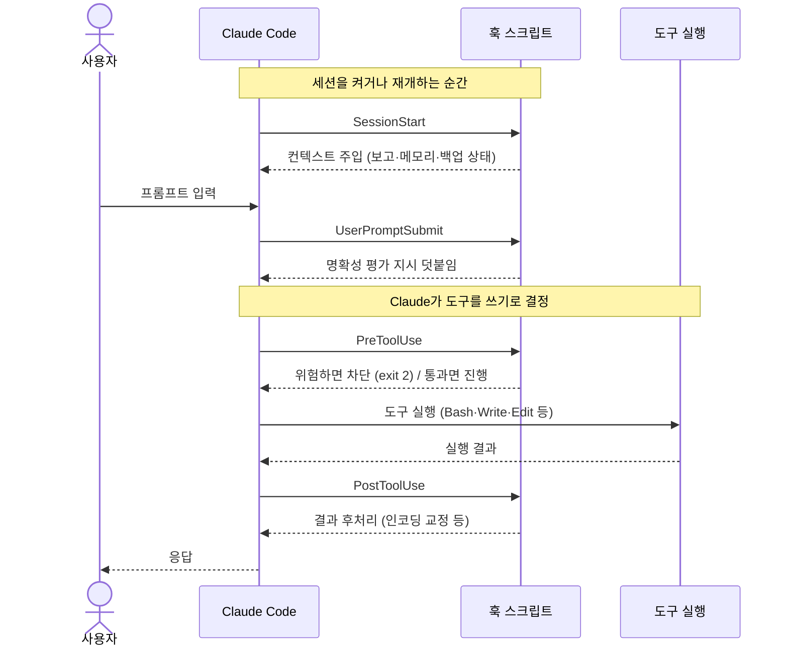

# 01. 훅(Hooks) — 자동으로 끼어드는 안전장치

> Claude Code의 동작 흐름 사이사이에 **내가 정한 스크립트**를 끼워 넣어, 실수를 막고 맥락을 주입하는 장치입니다. "잘하겠지"라는 신뢰 대신 **시스템 차원의 강제**를 거는 것이 핵심입니다.

---

## 🪝 훅이란?

훅은 Claude Code의 특정 시점(세션 시작, 도구 실행 직전/직후, 사용자 입력 직후 등)에 **자동으로 실행되는 스크립트**입니다. `<홈>/.claude/settings.json` 의 `hooks` 항목에 등록합니다.

이 셋업에서 가장 투자 대비 효과가 큰 부분입니다. "Claude가 알아서 잘하겠지"에 의존하지 않고, **시스템이 강제로** 실수를 막고 맥락을 주입합니다.

> [!IMPORTANT]
> 훅은 LLM의 판단에 의존하지 않습니다. Claude가 어떤 추론을 하든 상관없이, 등록된 시점이 되면 운영체제 수준에서 스크립트가 **반드시** 실행됩니다. "지시(프롬프트)"는 확률적으로 무시될 수 있지만, "훅"은 결정론적으로 작동합니다. 이것이 위험 차단·인코딩 교정 같은 비가역·고위험 영역을 훅으로 옮긴 이유입니다.

### 🧭 훅이 도는 자리 — 생명주기

훅을 이해하는 가장 빠른 길은 "Claude Code가 한 턴(turn)을 처리하는 동안 언제 끼어드는가"를 그림으로 보는 것입니다. 아래는 사용자가 한 번 입력했을 때 훅이 어느 지점에서 발동하는지를 나타낸 흐름입니다. (이 셋업의 훅 스크립트는 6종이며, 같은 이벤트에 여러 개가 걸리기도 합니다.)



> [!NOTE]
> `SessionStart`만 "한 턴"의 바깥, 즉 세션이 열리는 시점에 단 한 번 돕니다. 나머지 훅들은 사용자 입력 → 도구 사용 → 응답으로 이어지는 매 턴의 흐름 안에서 반복적으로 발동합니다.

### 📋 훅 종류(이벤트)

| 이벤트 | 시점 | 이 셋업에서의 용도 | 발동 빈도 |
|---|---|---|---|
| 🟢 `SessionStart` | 세션 시작/재개 | 오늘 보고·메모리·백업 상태를 맥락으로 주입 | 세션당 1회 |
| 🟡 `UserPromptSubmit` | 사용자가 입력할 때마다 | 모호한 프롬프트 감지 · caveman `ultra` 재주입 | 매 입력 |
| 🔴 `PreToolUse` | 도구 실행 직전 | 위험 명령 차단, 플랜 모드 가이드 | 매 도구 호출 |
| 🔵 `PostToolUse` | 도구 실행 직후 | 저장된 파일 인코딩 자동 교정 | 매 도구 호출 |

> [!TIP]
> 이벤트마다 `matcher`로 적용 대상을 좁힐 수 있습니다. 예를 들어 `PreToolUse`를 `Bash|PowerShell`에만 걸면 파일 읽기 같은 무해한 도구에는 훅이 돌지 않아 불필요한 오버헤드가 사라집니다. "전부 다 거는 것"보다 "필요한 도구에만 거는 것"이 성능과 안정성 모두에 유리합니다.

---

## 🛑 훅 1 — 위험 명령 차단 (`guard-dangerous-bash.ps1`)

**무엇**: `PreToolUse`에서 Bash/PowerShell 명령을 가로채, 비가역·위험 패턴이면 `exit 2`로 실행을 막습니다.

**차단 대상**:

| 패턴 | 위험 | 비고 |
|---|---|---|
| `rm -rf` / `Remove-Item -Recurse -Force` | 재귀·강제 삭제 | 복구 불가 |
| `git push --force` | 원격 히스토리 덮어쓰기 | 협업자 작업 유실 |
| `git reset --hard`, `git clean -f`, `git branch -D` | 작업물 손실 | 스테이지·작업 트리 소실 |
| `npm/pip uninstall` | 의존성 제거 | 빌드 깨짐 |
| `shutdown`, `Stop-Computer` | 시스템 종료 | 진행 중 작업 강제 중단 |

**왜 썼나**: LLM 에이전트는 "정리할게요" 하면서 `rm -rf`를 실제로 실행할 수 있습니다. 한 번 지워지면 끝입니다. 사람의 확인을 **시스템이 강제**하도록 만들었습니다.

> [!CAUTION]
> 실제로 자주 일어나는 사고는 "악의"가 아니라 "선의의 정리"입니다. 임시 파일을 치우겠다며 `rm -rf ./tmp/*`를 만들었는데 변수 전개가 비어 `rm -rf /`에 가까워지거나, 워킹 디렉터리를 착각해 엉뚱한 폴더를 지우는 식입니다. 이 훅은 "의도가 좋았는지"를 따지지 않고 **패턴 자체**를 막기 때문에 이런 류의 사고를 구조적으로 차단합니다.

**장점**:
- 비가역 사고를 원천 차단 (가장 무서운 실수를 구조적으로 제거)
- 차단 사유를 한국어로 명확히 출력 → Claude가 "사용자 확인이 필요하다"는 걸 인지하고 대안 제시
- 정규식 한 줄로 패턴 추가/완화 가능

**주의**:
- 패턴이 너무 넓으면 정상 명령까지 막혀 마찰이 커집니다. 반대로 너무 좁으면 우회 표현(예: `rm -r -f`, 변수에 담은 경로)을 놓칩니다. **자주 쓰는 안전 명령은 화이트리스트로 빼고, 정말 비가역인 것만 좁고 정확하게** 막는 균형이 중요합니다.
- 훅이 막더라도 사용자가 직접 터미널에서 실행하는 것까지 막지는 못합니다. 어디까지나 "에이전트의 자동 실행"에 대한 안전장치입니다.

→ [examples/hooks/guard-dangerous-bash.ps1](../examples/hooks/guard-dangerous-bash.ps1)

---

## 🔤 훅 2 — UTF-8 BOM 자동 교정 (`ensure-utf8-bom.ps1`)

**무엇**: `PostToolUse(Write|Edit)`에서, 방금 저장한 `.ps1` 파일에 BOM이 없으면 UTF-8 BOM을 자동으로 붙입니다.

**왜 썼나**: 한국어 Windows(PowerShell 5.1)는 BOM이 없는 UTF-8 파일을 CP949로 오해석합니다. 한글이 들어간 PowerShell 스크립트가 BOM 없이 저장되면 **콘솔에서 한글이 깨지고 스크립트가 오작동**합니다. 매번 손으로 BOM을 챙기는 건 비현실적이라 저장 시점에 자동화했습니다.

> [!WARNING]
> 이 문제는 "파일이 깨진 것처럼 보이는데 실제 바이트는 멀쩡한" 형태로 나타나기 때문에 디버깅이 까다롭습니다. 같은 파일을 VS Code(UTF-8 인식)에서는 정상으로 보다가, PowerShell 5.1 콘솔(CP949 기본)에서 실행하면 한글 주석·문자열이 `???`나 모지바케로 변해 분기·메시지 출력이 어긋납니다. 원인이 "코드 로직"이 아니라 "인코딩"이라 추적에 시간을 크게 잡아먹습니다.

**장점**:
- 한글 Windows 환경의 고질적 인코딩 버그를 저장 즉시 제거
- 대상 확장자/조건을 좁게 한정(`.ps1`만) → 부작용 없음
- BOM이 이미 있으면 건너뜀(멱등)

**주의**:
- 대상 확장자를 함부로 넓히면 안 됩니다. 예컨대 `.json`이나 `.py`에 BOM을 붙이면 일부 파서가 첫 바이트를 데이터로 읽어 **오히려 깨지는** 경우가 있습니다. BOM이 이득인 곳(`.ps1` 등 한글 Windows 콘솔에서 직접 실행되는 스크립트)에만 좁게 적용해야 합니다.

→ [examples/hooks/ensure-utf8-bom.ps1](../examples/hooks/ensure-utf8-bom.ps1)

---

## 📌 훅 3 — 세션 컨텍스트 주입 (`session-context.ps1`)

**무엇**: `SessionStart`에서 아래 4가지를 3~5줄로 요약해 화면 + Claude 컨텍스트에 주입합니다.

1. 마지막 일일보고가 언제였는지
2. 최근 갱신된 메모리 파일
3. 마지막 설정 백업 시점(8일 넘으면 ⚠️)
4. 다음 자동 백업 예정 시각

**왜 썼나**: 세션을 새로 켤 때마다 "어제 뭐 했더라", "백업은 돌고 있나"를 사람이 확인하는 건 비효율적입니다. 켜는 순간 현재 상태를 한눈에 보여주도록 했습니다. Claude도 이 맥락을 받아 이어서 작업합니다.

**핵심 기법**: 현재 작업 폴더(cwd)를 Claude의 `projects/` 인코딩 규칙(영숫자 외 문자를 `-`로 치환)으로 변환한 뒤, 상위로 거슬러 올라가며 `memory/` 폴더를 자동 탐지합니다. 덕분에 하위 어느 프로젝트에서 켜도 워크스페이스 공용 메모리를 찾아냅니다.

> [!TIP]
> 경로를 하드코딩하지 않고 "현재 위치에서 상위로 탐색"하는 방식이 핵심입니다. 회사 PC와 집 PC처럼 사용자 폴더 경로가 다른 여러 머신에서 같은 설정을 써도, 각 머신에서 알아서 메모리 폴더를 찾아내므로 머신마다 설정을 고칠 필요가 없습니다.

**장점**:
- 세션 시작 즉시 "지금 어디까지 와 있는지" 파악
- 백업 누락을 자동 경고 → 설정 유실 예방
- 경로 하드코딩 없이 어느 머신/프로젝트에서도 동작

**주의**:
- `SessionStart` 훅은 켤 때마다 도므로 **느리면 모든 세션 시작이 느려집니다.** 외부 네트워크 조회나 무거운 파일 스캔은 피하고, 로컬 파일의 수정 시각(mtime)을 읽는 정도의 가벼운 작업만 두는 것이 좋습니다.

→ [examples/hooks/session-context.ps1](../examples/hooks/session-context.ps1)

---

## 🤔 훅 4 — 프롬프트 명확성 평가 (`improve-prompt.py`)

**무엇**: `UserPromptSubmit`에서, 사용자가 입력할 때마다 "이 요청이 바로 실행 가능할 만큼 명확한가, 아니면 더 캐물어야 하나"를 평가하는 지시를 컨텍스트에 덧붙입니다.

| 입력 접두사 | 동작 |
|---|---|
| `*` | 평가 우회(명시적 바이패스) — 묻지 말고 바로 진행 |
| `/` (슬래시 명령) | 그대로 통과 |
| `#` (메모) | 그대로 통과 |
| (그 외) | 명확성 평가 지시를 덧붙임 |

**왜 썼나**: 모호한 한 줄("그거 고쳐줘")에 Claude가 추측으로 엉뚱한 작업을 하는 걸 줄이려고. 정말 모호할 때만 `prompt-improver` 스킬로 되묻게 합니다. 기본값은 "신뢰하고 바로 진행"이라 과도한 되물음은 막습니다.

> [!NOTE]
> 이 훅의 설계 철학은 "되묻기를 늘리는 것"이 아니라 "**정말 필요할 때만** 되묻는 것"입니다. 매번 캐물으면 마찰이 커져 오히려 사용자가 훅을 꺼버립니다. 그래서 기본값을 "신뢰·진행"으로 두고, 명백히 모호한 경우에만 한 번 확인하도록 임계값을 보수적으로 잡았습니다.

**장점**:
- 모호한 요청 → 잘못된 대량 작업으로 번지는 사고 감소
- 명확한 요청은 그대로 통과(마찰 없음)
- 바이패스 접두사로 사용자가 언제든 끌 수 있음

**주의**:
- 이 훅은 명확성을 "강제로 판정"하지 않고 Claude에게 **평가 지시를 주입**하는 방식이라, 최종 판단은 여전히 모델이 합니다. 임계값이 너무 빡빡하면 자명한 요청에도 되묻게 되어 마찰이 생기므로, 실제 사용 패턴을 보며 조정해야 합니다.

→ [examples/hooks/improve-prompt.py](../examples/hooks/improve-prompt.py)

---

## 📝 훅 5 — 플랜 모드 가독성 가이드 (`plan-guidance.py`)

**무엇**: `PreToolUse(EnterPlanMode)`에서, 계획을 작성할 때의 가독성 규칙을 주입합니다. "거절한 대안·수정 이력은 빼고, 한 스텝에 한 동작, 파일 경로를 앵커로(`<경로>/<파일>:42`), 설명보다 간결한 동작 위주로."

**왜 썼나**: 계획이 길어지면 "왜 이걸 안 했는지" 같은 메타 서술로 지저분해집니다. 읽기 좋은 실행 계획만 남도록 형식을 강제했습니다.

> [!TIP]
> 좋은 실행 계획은 "왜 안 했는지"가 아니라 "무엇을 할지"만 담습니다. 거절한 대안이나 수정 이력 같은 메타 서술은 검토자의 시선을 분산시킵니다. 한 스텝에 한 동작, 그리고 파일 경로를 `<경로>/<파일>:42`처럼 앵커로 박아두면 검토자가 곧바로 해당 위치로 점프할 수 있어 리뷰 속도가 올라갑니다.

**장점**:
- 매번 같은 품질의 깔끔한 실행 계획
- 계획 수정 시 이력 누적 없이 통째로 새로 쓰게 유도

**주의**:
- 이 훅은 "형식 가이드"를 주입할 뿐, 계획 내용의 정확성까지 보장하지는 않습니다. 형식이 깔끔하다고 계획이 옳은 것은 아니므로, 실행 전 사람의 검토는 여전히 필요합니다.

→ [examples/hooks/plan-guidance.py](../examples/hooks/plan-guidance.py)

---

## 🗿 훅 6 — caveman ultra 재주입 (`caveman-reinforce-ultra.js`)

**무엇**: `UserPromptSubmit`에서, caveman 모드가 `ultra`일 때만 **강한 ultra 압축 룰셋을 매 턴 다시 주입**합니다. flag 파일(`<홈>/.claude/.caveman-active`)을 읽어 현재 모드가 정확히 `ultra`가 아니면 아무것도 출력하지 않습니다.

**왜 썼나**: caveman 플러그인은 강한 전체 룰셋을 `SessionStart`에서 **한 번**만 주입합니다. 이 텍스트는 대화 내용의 일부라, `/compact`(자동 compact 포함)로 대화가 요약될 때 **함께 잘려 나갑니다.** 그 결과 compact 직후에는 약한 한 줄짜리 리마인더만 남아 **`ultra`가 슬그머니 `full`·`lite`로 약해집니다.** 매 입력마다 도는 `UserPromptSubmit`에 룰셋을 다시 박으면, compact 직후 첫 메시지부터 강도가 복구되고 세션 중간 드리프트도 잡힙니다.

> [!NOTE]
> 이 훅은 "압축을 강제로 수행"하는 것이 아니라, 모델이 따라야 할 **압축 지시를 매 턴 컨텍스트에 다시 얹는** 방식입니다. `SessionStart`가 세션당 1회라면 이 훅은 매 입력마다 도는 점이 핵심입니다. CC 버전이 compact 시 `SessionStart`를 재호출하는지와 무관하게 동작합니다.

**장점**:
- compact 후에도 `ultra` 강도 유지 → `/caveman ultra`를 매번 다시 칠 필요 없음
- flag 게이팅으로 `off`/`lite`/`full`은 그대로 통과(부작용 없음)
- 플러그인 소스가 아닌 **사용자 훅**이라 플러그인 업데이트에도 살아남음
- 모드가 `ultra`가 아니면 즉시 빠져나가므로(거의 무비용) 켜 두어도 무방

**주의**:
- 매 턴 ~100토큰이 주입됩니다(프롬프트 캐시로 비용은 작음). `ultra`의 절감이 더 크지만, 토큰을 극한으로 아껴야 하면 인지해 둘 값입니다.
- 출력 형식은 차단(`exit 2`)이 아니라 **컨텍스트 주입**(stdout JSON)입니다. 어떤 경우에도 프롬프트를 막지 않도록, 실패는 전부 조용히 삼키고 `exit 0` 합니다.
- PowerShell이 아닌 **Node.js 스크립트**입니다(플러그인과 동일한 런타임 재사용). 등록 시 `node "..."`로 호출합니다.

→ [examples/hooks/caveman-reinforce-ultra.js](../examples/hooks/caveman-reinforce-ultra.js) · 배경은 [06. caveman](06-caveman.md) 참고

---

## ⚙️ 등록 방법

`<홈>/.claude/settings.json` 의 `hooks`에 이벤트별로 등록합니다. 전체 예시는 [examples/settings.json](../examples/settings.json) 참고.

```jsonc
{
  "hooks": {
    "PreToolUse": [
      {
        "matcher": "Bash|PowerShell",
        "hooks": [{
          "type": "command",
          "command": "powershell -NoProfile -ExecutionPolicy Bypass -File \"<훅경로>\\guard-dangerous-bash.ps1\"",
          "shell": "powershell",
          "timeout": 5
        }]
      }
    ]
  }
}
```

> [!IMPORTANT]
> `command`의 훅 경로는 머신마다 다를 수 있으므로 `<훅경로>` 같은 placeholder로 두고, 실제 배포 시점에 각 머신의 경로로 채웁니다. 실값(사용자 폴더명·계정명 등)을 settings.json에 직접 박으면 공개 저장소에 노출될 위험이 있으니 주의합니다.

### 🧱 훅 작성 핵심 규칙

| 규칙 | 설명 |
|---|---|
| 입력 | 훅은 stdin으로 JSON(도구명·인자 등)을 받습니다. 첫 줄에서 읽고 파싱하세요. |
| 차단 | **차단하려면 `exit 2`** + stderr에 사유 출력. `exit 0`은 통과. |
| 컨텍스트 주입 | `hookSpecificOutput.additionalContext` JSON을 stdout에 출력. |
| 속도 | 절대 느려선 안 됩니다(매 도구 호출마다 실행). `timeout`을 짧게. |

<details>
<summary>📥 stdin으로 들어오는 JSON 예시 (PowerShell 파싱)</summary>

훅은 실행될 때 표준 입력(stdin)으로 도구 호출 정보가 담긴 JSON 한 덩어리를 받습니다. PowerShell에서는 아래처럼 읽어 파싱합니다.

```powershell
# stdin 전체를 읽어 JSON 객체로 변환
$payload = [Console]::In.ReadToEnd() | ConvertFrom-Json

# 예: 실행하려는 명령 문자열 꺼내기
$command = $payload.tool_input.command

if ($command -match 'rm\s+-rf|Remove-Item.*-Recurse.*-Force') {
    # stderr로 사유를 출력하고 exit 2 → 실행 차단
    [Console]::Error.WriteLine("비가역 삭제 명령이 감지되어 차단했습니다. 사용자 확인이 필요합니다.")
    exit 2
}

exit 0  # 안전하면 통과
```

</details>

<details>
<summary>📤 컨텍스트를 주입하는 출력 예시 (additionalContext)</summary>

`SessionStart`나 `UserPromptSubmit`처럼 "막는 것"이 아니라 "맥락을 더해주는" 훅은, 표준 출력(stdout)으로 아래 형태의 JSON을 내보냅니다. 이 텍스트가 Claude의 컨텍스트에 합쳐집니다.

```jsonc
{
  "hookSpecificOutput": {
    "additionalContext": "마지막 일일보고: <YYYY-MM-DD> · 최근 백업: <YYYY-MM-DD> · 다음 백업: <YYYY-MM-DD HH:mm>"
  }
}
```

> [!NOTE]
> 차단(`exit 2`)과 컨텍스트 주입(stdout JSON)은 **목적이 다른 두 경로**입니다. 위험 차단 훅은 stderr + `exit 2`를 쓰고, 맥락 주입 훅은 stdout에 JSON을 출력합니다. 둘을 헷갈리면 "막으려 했는데 통과"하거나 "주입하려 했는데 차단"되는 일이 생깁니다.

</details>

> [!CAUTION]
> 훅은 **매 도구 호출마다** 실행될 수 있으므로 성능이 곧 사용성입니다. 외부 네트워크 호출, 무거운 패키지 import, 광범위한 파일 스캔을 훅 안에 넣으면 모든 명령이 느려집니다. `timeout`을 짧게(예: 5초) 잡아 훅이 멈춰도 전체 세션이 멈추지 않게 하고, 무거운 작업은 비동기·백그라운드로 빼는 것이 안전합니다.

---

<div align="center">

[⬅️ 이전: 00. 빠른 시작](00-quickstart.md) · [🏠 목차](../README.md) · [다음: 02. 스킬 ➡️](02-skills.md)

</div>
