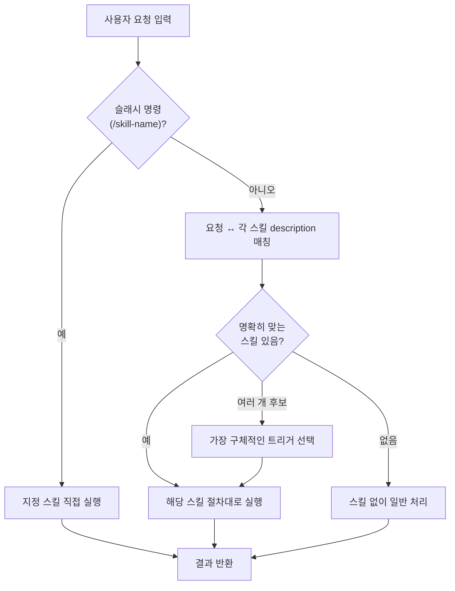
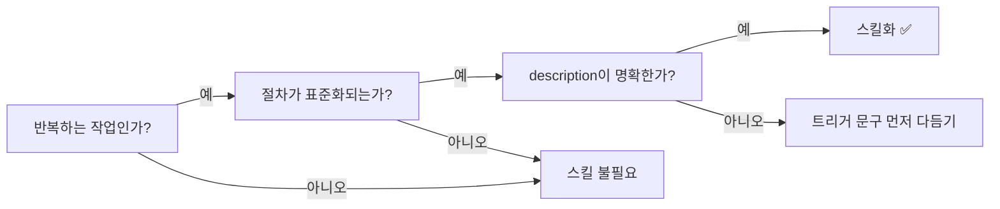

# 02. 스킬(Skills) — 작업 절차를 캡슐화

> 같은 요청에 **매번 다른 방식**으로 답하는 대신, **한 번 검증한 절차**를 모듈로 굳혀 재사용합니다.

---

## 🧩 스킬이란?

스킬은 "이런 작업은 이렇게 해라"는 **검증된 절차 + 도구 묶음**을 마크다운(+선택적 스크립트)으로 캡슐화한 모듈입니다. 사용자가 관련 작업을 요청하면 Claude가 알아서 해당 스킬을 불러 그 절차대로 수행합니다.

| 항목 | 내용 |
|---|---|
| 📁 **위치** | `~/.claude/skills/<skill-name>/SKILL.md` |
| 🚀 **호출** | 사용자가 `/<skill-name>` 으로 직접 호출하거나, Claude가 `description`을 보고 **자동 선택** |
| 🎯 **핵심** | 각 스킬의 `description`이 트리거 정확도를 좌우 → "언제 써야 하는지"를 구체적으로 적는 게 가장 중요 |

> [!IMPORTANT]
> 스킬의 품질은 본문(절차)보다 `description`이 먼저 결정합니다. `description`이 모호하면 **정작 필요할 때 발동하지 않거나, 엉뚱한 순간에 끼어듭니다.** 트리거 문구는 "사용자가 실제로 쓸 법한 표현"을 그대로 나열하는 게 정확도를 높입니다.

**왜 쓰나**: "PPT 만들어줘" 한마디에, 매번 다른 방식이 아니라 **항상 같은 검증된 절차**가 적용됩니다. 좋은 작업 방식을 한 번 정의해두면 사람이 매번 같은 지시를 반복할 필요가 없습니다.

---

## 🔀 스킬 자동 선택 흐름

사용자의 요청이 들어오면, Claude는 각 스킬의 `description`과 요청을 대조해 가장 잘 맞는 스킬을 고릅니다. 슬래시(`/skill-name`)로 명시하면 매칭 단계를 건너뜁니다.



> [!TIP]
> 어떤 스킬이 발동할지 헷갈릴 때는 `/skill-name`으로 **명시 호출**하면 매칭 단계를 건너뛰어 확실합니다. 반대로 평소에는 자동 선택에 맡기고, 오발동이 잦은 스킬만 `description`을 다듬는 게 효율적입니다.

---

## 🗂️ 스킬 카테고리 분류도

이 셋업의 스킬은 크게 **직접 설치한 실무 스킬**과 **번들로 따라오는 스킬군**으로 나뉩니다. 용도별로 묶으면 아래와 같습니다.

```mermaid
flowchart TB
    Root["설치된 스킬"] --> A["보고·산출물"]
    Root --> B["CV·ML"]
    Root --> C["엔지니어링"]
    Root --> D["디자인·UX"]
    Root --> E["메타·유틸"]

    A --> A1["pptx / frontend-slides"]
    A --> A2["frontend-design / theme-factory"]
    A --> A3["anydesign / d3-viz / web-artifacts-builder"]

    B --> B1["pytorch-patterns"]
    B --> B2["senior-computer-vision"]

    C --> C1["code-review / debug"]
    C --> C2["system-design / testing-strategy"]
    C --> C3["documentation / deploy-checklist"]

    D --> D1["design-critique / accessibility-review"]
    D --> D2["design-system / ux-copy"]

    E --> E1["skill-creator / mcp-builder"]
    E --> E2["prompt-improver / recursive-research"]
    E --> E3["docx / pdf / xlsx / schedule"]
    E --> E4["karpathy-guidelines (행동 가드레일)"]
```



---

## ⭐ 실무에서 자주 쓴 스킬 (직접 설치)

아래는 워크스페이스에 **직접 설치**해 실제로 가장 자주 쓴 스킬들입니다. "언제 빛났나" 열은 이 스킬이 구체적으로 어떤 순간에 도움이 됐는지를 적었습니다.

| 스킬 | 용도 | 언제 빛났나 |
|---|---|---|
| 📊 `pptx` | PowerPoint 생성/편집/읽기 | 보고용 슬라이드 초안 자동 생성 |
| 🎨 `anydesign` | 이미지·웹·Figma의 디자인을 토큰/컴포넌트로 추출 | 레퍼런스 UI 분석·복제 |
| 📈 `d3-viz` | d3.js 인터랙티브 시각화 | 커스텀 차트·네트워크 다이어그램 |
| 🖥️ `frontend-design` | 완성도 높은 프런트엔드 UI 생성 | 랜딩·대시보드 초안 |
| 🎞️ `frontend-slides` | HTML 애니메이션 프레젠테이션 | 발표용 웹 슬라이드 |
| 🌈 `theme-factory` | 산출물에 일관된 테마(색·폰트) 적용 | 슬라이드·문서 스타일 통일 |
| 🧱 `web-artifacts-builder` | React/Tailwind/shadcn 복합 아티팩트 | 상태관리 있는 데모 |
| 🧪 `webapp-testing` | Playwright로 로컬 웹앱 검증 | 프런트 동작·스크린샷 확인 |
| 🔥 `pytorch-patterns` | PyTorch 학습 파이프라인 베스트프랙티스 | 재현 가능한 학습 코드 |
| 👁️ `senior-computer-vision` | 객체탐지·세그멘테이션·배포 | YOLO/DETR 파이프라인, ONNX/TensorRT |
| 🔌 `mcp-builder` | MCP 서버 제작 가이드 | 외부 API를 Claude 도구로 |
| ✍️ `prompt-improver` | 모호한 프롬프트를 리서치·질문으로 보강 | 훅과 연동해 되묻기 |
| 🔬 `recursive-research` | 자기조절 재귀 심층 리서치 | 도메인 깊이 탐구 |
| 🧭 `karpathy-guidelines` | LLM 코딩 실수 차단 4대 가드레일(과설계·범위이탈·침묵추측·미검증 완료) | 자율 코드 작업의 품질 안전망 |

> [!NOTE]
> 컴퓨터 비전 배경 + 프런트엔드 보고 산출물이라는 작업 조합이라, **CV 학습(pytorch / cv) + 보고 산출물(pptx / frontend / theme) 양쪽**을 함께 설치했습니다. 자신의 주력 작업 두세 갈래를 먼저 정하고, 그 갈래에 해당하는 스킬부터 까는 게 시행착오를 줄입니다.

---

## 📦 번들로 함께 쓴 스킬군

따로 설치하지 않아도 기본 제공되거나 묶음으로 들어오는 유용한 스킬들입니다. 카테고리별로 묶어 두면 "이 일은 어느 군에서 찾으면 되는지"가 분명해집니다.

<details>
<summary><b>anthropic-skills</b> — 오피스 문서·메타 작업 (펼치기)</summary>

| 스킬 | 용도 |
|---|---|
| `docx` | Word 문서 생성/편집/읽기 |
| `pdf` | PDF 읽기·병합·분할·폼 작성·OCR |
| `xlsx` | 스프레드시트 생성/편집/정리 |
| `pptx` | 오피스 슬라이드 전반 |
| `consolidate-memory` | 메모리 파일 정리·중복 병합 |
| `skill-creator` | 새 스킬 제작·평가·최적화 |
| `schedule` | 자동작업(스케줄) 등록 |

</details>

<details>
<summary><b>engineering</b> — 개발 라이프사이클 (펼치기)</summary>

| 스킬 | 용도 |
|---|---|
| `code-review` | 보안·성능·정확성 코드 리뷰 |
| `debug` | 재현→격리→진단→수정 디버깅 |
| `system-design` | 시스템·API·데이터 모델 설계 |
| `testing-strategy` | 테스트 전략·커버리지 설계 |
| `tech-debt` | 기술부채 식별·우선순위화 |
| `documentation` | README·런북·API 문서 작성 |
| `deploy-checklist` | 배포 전 점검 체크리스트 |
| `incident-response` | 장애 대응·포스트모템 |
| `standup` | 최근 활동 기반 스탠드업 정리 |
| `architecture` | ADR(아키텍처 결정 기록) 작성 |

</details>

<details>
<summary><b>design</b> — 디자인·UX (펼치기)</summary>

| 스킬 | 용도 |
|---|---|
| `design-critique` | 사용성·위계·일관성 피드백 |
| `accessibility-review` | WCAG 2.1 AA 접근성 감사 |
| `design-system` | 디자인 시스템 감사·확장 |
| `design-handoff` | 개발 핸드오프 스펙 생성 |
| `ux-copy` | 마이크로카피·에러 메시지 작성 |
| `user-research` | 사용자 리서치 설계·진행 |
| `research-synthesis` | 리서치 결과 테마·인사이트 정리 |

</details>

<details>
<summary><b>caveman</b> — 토큰 압축 모드 (펼치기)</summary>

caveman 모드 계열은 토큰 사용량을 줄이는 압축 커뮤니케이션 도구군입니다. 별도 문서에서 자세히 다룹니다 → [06-caveman.md](06-caveman.md)

</details>

---

## ✅ 스킬 고를 때 기준

새 스킬을 만들지 말지 고민될 때는 아래 세 가지를 차례로 따져봅니다. 셋 다 "예"면 스킬화 후보입니다.



1. **반복하는 작업인가** — 한 번 하고 말 거면 스킬화는 과투자입니다.
2. **절차가 표준화되는가** — "항상 이 순서로 하는 게 맞다"가 있으면 스킬 후보입니다. 매번 판단이 갈리는 작업은 스킬로 굳히면 오히려 경직됩니다.
3. **description이 명확한가** — 트리거가 애매하면 엉뚱할 때 발동하거나 정작 필요할 때 안 뜹니다.

> [!WARNING]
> 트리거가 겹치는 스킬을 여러 개 깔면 **서로 오발동**합니다. 예를 들어 `description`에 "문서 작성"처럼 광범위한 문구가 둘 이상 있으면, 매칭 단계에서 의도와 다른 스킬이 선택될 수 있습니다. 새 스킬을 추가할 때는 기존 스킬과 트리거가 충돌하지 않는지 먼저 확인하세요.

---

## 🛠️ 직접 만들기

`skill-creator` 스킬로 새 스킬을 생성·평가·최적화할 수 있습니다. 핵심은 `SKILL.md`의 frontmatter입니다.

```markdown
---
name: <my-skill>
description: <언제 이 스킬을 써야 하는지 — 구체적 트리거 문구를 나열>
---

<수행 절차. 단계별로. 도구 사용 규칙 포함.>
```

> [!TIP]
> `description`에는 **사용자가 실제로 칠 법한 표현을 그대로** 넣으세요. "이미지를 분석해줘", "이 화면 비평해줘"처럼 자연어 트리거를 여러 개 나열할수록 자동 선택 정확도가 올라갑니다. 추상적인 한 줄("디자인 관련 작업")보다 구체적인 여러 줄이 훨씬 잘 잡힙니다.

### 작성 시 주의

- ⚠️ **트리거 중복 회피**: 기존 스킬과 `description`이 겹치면 오발동의 원인이 됩니다. 추가 전에 한 번 점검합니다.
- ⚠️ **절차는 단계별로**: 본문에는 "무엇을, 어떤 순서로, 어떤 도구로" 하는지를 명시합니다. 모호하면 스킬이 발동해도 결과가 흔들립니다.
- ⚠️ **너무 넓게 잡지 않기**: 한 스킬이 모든 걸 하려 들면 트리거가 광범위해져 오발동합니다. 한 스킬은 한 가지 일을 잘하게 좁히는 편이 안전합니다.

> [!NOTE]
> **출처**: 스킬은 [ComposioHQ/awesome-claude-skills](https://github.com/ComposioHQ/awesome-claude-skills) · [travisvn/awesome-claude-skills](https://github.com/travisvn/awesome-claude-skills) · [VoltAgent/awesome-agent-skills](https://github.com/VoltAgent/awesome-agent-skills) 같은 모음을 1차 소스로 참고해 `~/.claude/skills/`에 설치하면 됩니다. 모음에서 가져온 스킬도 `description`은 자신의 작업 어휘에 맞게 다듬어 두는 게 자동 선택 정확도에 유리합니다.
>
> `karpathy-guidelines`는 [multica-ai/andrej-karpathy-skills](https://github.com/multica-ai/andrej-karpathy-skills)(MIT)의 4대 행동 가드레일을 한국어·자율운영 환경에 맞춰 각색해 설치했습니다.

---

<div align="center">

[⬅️ 이전: 01. 훅](01-hooks.md) · [🏠 목차](../README.md) · [다음: 03. 메모리 ➡️](03-memory.md)

</div>
