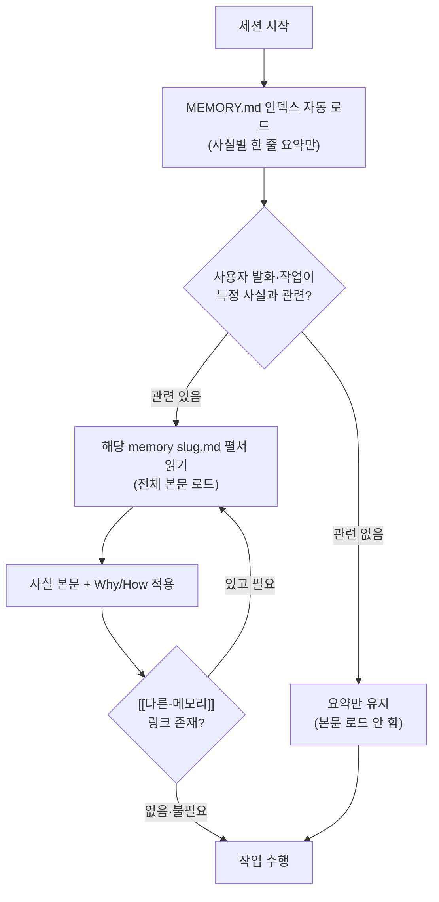
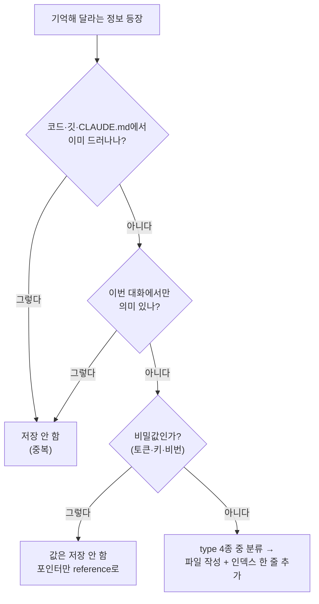

# 🧠 03. 메모리 — 세션을 넘어 기억하기

이 문서는 Claude Code가 세션이 끝나도 사용자·프로젝트·작업 방식에 대한 맥락을 **영속적으로 기억**하게 만드는 파일 기반 메모리 구조를 설명합니다. "한 가지 사실 = 한 개 파일", "인덱스만 항상 로드"라는 두 가지 핵심 원칙을 중심으로, 무엇을 저장하고 무엇을 저장하지 말아야 하는지까지 다룹니다.

---

## ❓ 왜 메모리가 필요한가 (문제 정의)

Claude Code 세션은 기본적으로 **휘발성(volatile)** 입니다. 대화 창을 닫는 순간 다음과 같은 맥락이 모두 사라집니다.

- "나는 한국어로 답변받기를 선호한다."
- "내 환경은 Windows 이고, 셸은 PowerShell 이다."
- "이 기능은 외부 의존성 문제로 이미 보류하기로 결정했다."

이런 맥락을 매 세션마다 사람이 다시 설명하는 것은 **시간 낭비이자 일관성 저하**의 원인입니다. 같은 결정을 두 번 내리게 되거나, 이미 합의한 방침을 잊고 어긋난 작업을 하게 됩니다.

> [!NOTE]
> 메모리는 "대화를 더 똑똑하게" 만드는 기능이 아니라, **세션 사이의 단절을 메우는** 기능입니다. 한 번 학습한 사실을 다음 세션이 그대로 이어받게 하는 것이 목표입니다.

> [!IMPORTANT]
> 메모리는 **장기적으로 안정적인 사실**을 위한 것입니다. "지금 이 버그를 고치는 중"처럼 이번 대화에서만 의미 있는 정보는 메모리 대상이 아닙니다(자세한 기준은 아래 [무엇을 저장하면 안 되나](#-무엇을-저장하면-안-되나) 참조).

---

## 💡 해법: 파일 기반 영속 메모리

해결책의 핵심은 단순합니다. **한 가지 사실을 하나의 파일에 저장**하고, 프론트매터(front matter)로 분류한 뒤, `MEMORY.md` 인덱스에 한 줄 요약으로 묶습니다.

| 구성 요소 | 경로 | 역할 |
|---|---|---|
| 🗂️ 메모리 루트 | `~/.claude/projects/<인코딩된-cwd>/memory/` | 모든 메모리 파일이 모이는 디렉터리 |
| 📑 인덱스 | `memory/MEMORY.md` | 매 세션 **자동 로드**되는 목차(사실별 한 줄 요약) |
| 📄 개별 사실 | `memory/<slug>.md` | 본문에 **단 하나의 사실**을 담는 파일 |

> [!TIP]
> `<인코딩된-cwd>` 는 현재 작업 디렉터리 경로를 안전한 문자열로 변환한 값입니다. 즉 메모리는 **프로젝트(작업 디렉터리)별로 분리**되어 저장됩니다. 한 프로젝트에서 쌓은 메모리가 다른 프로젝트로 새지 않습니다.

### 📝 파일 형식

각 메모리 파일은 YAML 프론트매터 + 마크다운 본문으로 구성됩니다.

```markdown
---
name: <짧은-kebab-슬러그>
description: <한 줄 요약 — 관련성 판단에 쓰임>
metadata:
  type: user | feedback | project | reference
---

<사실 본문. feedback/project는 **Why:** / **How to apply:** 줄 권장.
 [[다른-메모리-name]] 으로 연결.>
```

각 필드의 의미는 다음과 같습니다.

| 필드 | 설명 | 왜 중요한가 |
|---|---|---|
| `name` | 파일을 가리키는 짧은 kebab-case 슬러그 | `[[name]]` 링크의 대상 식별자. 사람이 읽기 쉽고 충돌이 적어야 함 |
| `description` | 한 줄 요약 | Claude 가 이 메모리를 **펼칠지 말지** 판단하는 1차 기준. 핵심 키워드를 담을수록 정확히 호출됨 |
| `metadata.type` | 4종 분류 중 하나 | 메모리의 성격을 규정. 인덱스에서 섹션을 나누는 기준 |

> [!CAUTION]
> `description` 을 너무 모호하게 쓰면("여러 가지 메모", "기타 사항") Claude 가 그 파일을 언제 펼쳐야 할지 판단하지 못합니다. **관련성 신호가 되는 구체적 단어**(도구명·상황·결정 키워드)를 반드시 포함하십시오.

---

## 🔀 핵심 작동 구조: 인덱스 항상 로드, 사실은 필요시 펼침

메모리 구조의 가장 중요한 설계는 **"전체를 통째로 읽지 않는다"** 는 점입니다. 인덱스(`MEMORY.md`)의 한 줄 요약만 항상 로드되고, 개별 사실 파일은 그 사실이 실제로 관련 있을 때만 펼쳐집니다.



이 구조의 효과는 명확합니다. 메모리가 수십 개로 늘어나도 **세션 시작 시 항상 로드되는 양은 인덱스(짧은 요약 묶음) 하나뿐**입니다. 무거운 본문은 그 사실이 실제로 필요한 순간에만 컨텍스트로 들어옵니다.

> [!TIP]
> 인덱스는 "목차이자 라우터"입니다. 본문이 아무리 길어도 인덱스 한 줄이 정확하면 Claude 가 올바른 순간에 정확한 파일을 펼칩니다. 그래서 **인덱스 한 줄 요약의 품질이 메모리 시스템 전체의 정확도를 좌우**합니다.

---

## 🏷️ 분류(type) 4가지

모든 메모리는 아래 4가지 `type` 중 하나로 분류됩니다. 이 분류는 단순한 라벨이 아니라, 인덱스의 섹션을 나누고 "이 메모리를 언제 떠올려야 하는가"를 규정하는 기준입니다.

| type | 무엇을 담나 | 핵심 질문 | 예시 |
|---|---|---|---|
| 👤 `user` | 사용자가 누구인지 (역할·전문성·취향) | "이 사람에게 어떻게 맞춰야 하나?" | "컴퓨터 비전 배경, 한국어 선호, PowerShell 환경" |
| 🛠️ `feedback` | 작업 방식 지침 (교정·확인된 접근) | "어떻게 일해야 하나?" | "삭제 전 항상 확인받기 — Why/How 포함" |
| 📦 `project` | 코드·깃 이력에 안 드러나는 진행 맥락 | "지금 이 프로젝트의 상태·결정은?" | "이 기능은 외부 의존성 <X> 때문에 보류 중" |
| 🔗 `reference` | 외부 리소스 포인터 | "그 자료 어디 있더라?" | "대시보드 <URL>, 티켓 번호 <ID>" |

각 type 을 좀 더 구체적으로 풀어보면 다음과 같습니다.

<details>
<summary>👤 user — 사용자 정체성·선호</summary>

사용자의 역할, 전문 배경, 작업 환경, 커뮤니케이션 취향처럼 **세션이 바뀌어도 거의 변하지 않는** 정보입니다. 매번 "한국어로 답변해 주세요", "저는 Windows 를 씁니다"를 다시 말하지 않게 하는 것이 목적입니다.

- 좋은 예: "컴퓨터 비전 배경 → 모델·평가 용어는 부연 없이 사용해도 됨"
- 좋은 예: "보고 문서는 격식체(~습니다체)를 선호"
- 주의: 일회성 기분·요청은 user 가 아닙니다. "오늘은 짧게 답해줘"는 저장 대상이 아닙니다.

</details>

<details>
<summary>🛠️ feedback — 작업 방식 지침</summary>

"이렇게 일해 달라"는 **행동 규칙**입니다. 사용자가 한 번 교정했거나 명시적으로 확인해 준 접근 방식을 담습니다. 이 type 은 본문에 **`Why:`(왜 그런가)** 와 **`How to apply:`(어떻게 적용하나)** 줄을 함께 적는 것을 강하게 권장합니다 — 규칙만 있고 근거가 없으면 다른 상황에 잘못 일반화되기 쉽기 때문입니다.

```markdown
---
name: confirm-before-delete
description: 파일·의존성 삭제 등 비가역 작업 전에는 항상 확인받기
metadata:
  type: feedback
---

비가역적(삭제·일괄 변경) 작업은 자동 실행하지 말고 먼저 확인받는다.

**Why:** 되돌릴 수 없는 작업에서 추측이 틀리면 복구 비용이 큼.
**How to apply:** 삭제·일괄 수정 직전에 대상과 영향 범위를 요약해 보고하고 대기.
```

</details>

<details>
<summary>📦 project — 코드에 안 드러나는 진행 맥락</summary>

깃 로그나 코드만 봐서는 알 수 없는 **"왜"와 "지금 상태"** 를 담습니다. 코드가 답하지 못하는 질문, 즉 의사결정의 배경·보류 사유·선택지 비교 결과 같은 것입니다.

- 좋은 예: "후보 <A> 대신 <B> 를 채택 — <A> 는 라이선스 제약, <B> 가 요구사항 충족"
- 좋은 예: "이 모듈은 외부 기관 데이터 <상태> 때문에 일정 보류 중"
- 주의: "함수 `foo` 가 `bar` 를 호출한다" 같은 코드에서 바로 읽히는 사실은 저장하지 않습니다(중복).

</details>

<details>
<summary>🔗 reference — 외부 리소스 포인터</summary>

자주 찾게 되는 외부 자료의 **위치 정보**입니다. 값 자체가 아니라 "어디에 있는지"를 가리킵니다.

- 좋은 예: "주간 보고 대시보드 <URL>", "이슈 트래커 프로젝트 <ID>"
- 좋은 예: "백업 산출물은 <경로> 에 주 단위로 적재"
- 주의: **자격증명·토큰·비밀번호 값 자체는 저장 금지**. 어디서 가져오는지(환경변수명 등)만 가리킵니다.

</details>

> [!WARNING]
> `reference` 메모리에 **API 키·토큰·비밀번호 같은 비밀값을 직접 적지 마십시오.** 메모리 파일은 평문으로 저장되며 동기화·백업 경로를 탈 수 있습니다. 비밀값은 환경변수나 비밀 관리 도구에 두고, 메모리에는 "어디서 어떻게 가져오는지"만 적습니다.

---

## ✅ 왜 이 구조가 좋은가

1. **인덱스만 항상 로드** — 전체 메모리를 매 세션 통째로 불러오면 컨텍스트가 빠르게 소진됩니다. `MEMORY.md` 의 한 줄 요약만 항상 로드하고, 필요할 때 해당 파일을 펼치므로 메모리가 늘어나도 상시 비용이 거의 일정합니다.
2. **한 파일 = 한 사실** — 갱신·삭제가 외과적입니다. 어떤 사실이 틀리거나 낡았으면 그 파일 하나만 지우거나 고치면 되고, 다른 사실에 영향을 주지 않습니다.
3. **연결(`[[name]]`)** — 관련 사실끼리 위키처럼 링크합니다. 아직 존재하지 않는 메모리 이름을 가리켜도 괜찮습니다 — 나중에 채워 넣을 "할 일 표시"로 기능합니다.
4. **타이밍** — 사용자가 같은 것을 **정정하거나 반복할 때**가 메모리화의 최적 시점입니다. 그 순간이 바로 "이건 일회성이 아니라 안정적인 사실"이라는 신호입니다.

> [!TIP]
> 메모리를 만들 가장 좋은 순간은 사용자가 **"아까도 말했는데"** 또는 **"매번 그렇게 해줘"** 라고 말할 때입니다. 반복·정정은 그 사실이 세션을 넘어 유지될 가치가 있다는 가장 확실한 증거입니다.

---

## 🚫 무엇을 저장하면 안 되나

메모리는 무한정 쌓는 곳이 아닙니다. 다음은 **저장하면 안 되는** 대표 사례입니다.

| 저장하면 안 되는 것 | 이유 | 대신 무엇을 |
|---|---|---|
| 코드 구조·과거 수정·깃 이력 | 코드·로그에서 이미 읽힘 (중복) | 그대로 코드/깃에서 확인 |
| `CLAUDE.md` 에 이미 있는 지침 | 항상 로드되는 규칙과 중복 | `CLAUDE.md` 를 단일 출처로 유지 |
| 이번 대화에서만 의미 있는 것 | 세션 종료와 함께 무의미해짐 | 저장하지 않음 |
| 비밀값(토큰·키·비밀번호) | 평문 저장·유출 위험 | 환경변수·비밀 관리 도구, 포인터만 메모리에 |

> [!IMPORTANT]
> 사용자가 **"이거 기억해"** 라고 했더라도 위 표에 해당하면 그대로 저장하지 않습니다. 대신 **"이 중 무엇이 비자명(non-obvious)한가?"** 를 되물어, 코드·이력에서 드러나지 않는 핵심 한 가지만 추출해 저장합니다.

### 판단 흐름 — 저장 vs 비저장



> [!CAUTION]
> 중복·일회성 정보까지 메모리에 쌓으면 인덱스가 비대해지고, Claude 가 **무엇이 진짜 중요한지** 가려내기 어려워집니다. 메모리의 가치는 양이 아니라 **신호 대 잡음비**에 있습니다.

---

## 🧹 자동 정리 (Consolidation)

메모리는 시간이 지나면 **중복·모순·진부화(stale)** 가 자연스럽게 쌓입니다. 같은 사실을 두 번 적거나, 결정이 바뀌었는데 옛 메모리가 남아 있거나, 인덱스 요약이 본문과 어긋나는 일이 생깁니다.

이를 위해 `consolidate-memory` 스킬과 **월 1회 자동 루틴**([04-automation.md](04-automation.md))으로 주기적으로 정리합니다.

- 🔁 **중복 병합** — 같은 사실을 가리키는 파일을 하나로 합침
- ⚖️ **모순 해소** — 서로 어긋나는 사실 중 최신·정확한 것만 남김
- 🗑️ **낡은 사실 제거** — 더 이상 유효하지 않은 결정·상태 삭제
- 📑 **인덱스 정합성 점검** — `MEMORY.md` 의 한 줄 요약이 실제 본문과 일치하는지 확인

> [!NOTE]
> 자동 정리는 "메모리를 줄이는" 작업이 아니라 **"메모리를 신뢰할 수 있게 유지하는"** 작업입니다. 정리를 게을리하면 모순된 사실 때문에 Claude 가 잘못된 결정을 학습한 채로 행동할 수 있습니다.

---

## 🧾 예시 인덱스 (`MEMORY.md`)

아래는 4종 type 이 섹션별로 정리된 인덱스의 최소 예시입니다. 각 줄은 **링크 + 한 줄 요약** 형태이며, 이 요약만으로 Claude 가 "지금 이 파일을 펼칠지" 판단합니다.

```markdown
# Memory Index

## User
- [사용자 프로필](user_profile.md) — 역할·배경·선호 한 줄

## Project
- [프로젝트 A](project_a.md) — 목표·제약·현재 상태 한 줄

## Feedback
- [자율 운영 원칙](feedback_autonomous.md) — 직접 적용 후 보고, 비가역은 확인

## Reference
- [백업 인프라](reference_backup.md) — 매주 금 자동 백업, 8주 보관
```

> [!TIP]
> 인덱스 한 줄을 쓸 때는 **"이 줄만 보고도 펼칠지 말지 판단할 수 있는가?"** 를 자문하십시오. "기타 메모"처럼 모호한 요약은 라우팅을 망칩니다. 반대로 핵심 키워드(상황·결정·대상)가 들어간 요약은 정확한 순간에 정확한 파일을 끌어옵니다.

---

<div align="center">

[⬅️ 이전: 02. 스킬](02-skills.md) · [🏠 목차](../README.md) · [다음: 04. 자동 루틴 ➡️](04-automation.md)

</div>
