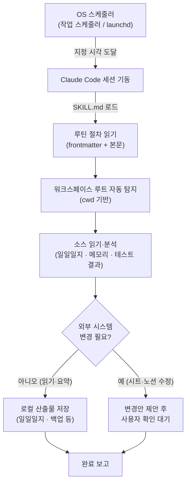

# 04. 자동 루틴 — 정해진 시간에 도는 작업

> 정해 둔 시각에 OS 스케줄러가 Claude Code를 깨워, 미리 작성해 둔 절차를 사람 손 없이 수행하게 만드는 구조를 다룹니다. 보고 취합, 백업, 메모리 정리처럼 "매번 같은 일"을 스케줄러에 위임하는 방법과, 안전을 위한 설계 원칙을 설명합니다.

---

## 📌 한눈에 보기

| 항목 | 내용 |
|---|---|
| 🎯 목적 | 반복 작업(보고·백업·정리)을 정해진 시각에 자동 수행 |
| 🧩 정의 위치 | `~/.claude/scheduled-tasks/<task>/SKILL.md` |
| ⏰ 실행 주체 | OS 스케줄러 (Windows 작업 스케줄러 / macOS launchd) |
| 🛡️ 핵심 원칙 | **자동은 읽기, 변경은 제안** |
| 🌐 이식성 | 경로 하드코딩 금지 → Windows·macOS 동일 정의 |

---

## 🧠 개념 — 자동 루틴이란?

`scheduled-tasks`는 **OS 스케줄러**(Windows 작업 스케줄러 / macOS launchd)가 정해진 시각에 Claude Code를 띄워, 미리 정의한 절차(`SKILL.md`)를 수행하게 하는 자동 루틴입니다. 사람이 매번 같은 명령을 입력할 필요 없이, "정해진 때가 되면 알아서 도는" 백그라운드 작업이라고 이해하면 됩니다.

구성 요소는 세 가지로 나뉩니다.

| 구성 요소 | 설명 |
|---|---|
| 📄 **정의** | `~/.claude/scheduled-tasks/<task>/SKILL.md` — frontmatter(`name`/`description`)와 본문 절차로 구성 |
| ⏰ **실행** | OS 스케줄러가 지정 시각에 트리거하여 Claude Code 세션을 기동 |
| 🛡️ **원칙** | 자동 루틴은 **읽기·분석 위주**. 외부 시스템(시트·노션) 자동 수정은 지양하고 "제안"만 함 |

> [!NOTE]
> 자동 루틴의 본질은 "스케줄러가 Claude를 대신 실행한다"는 점입니다. Claude가 스스로 시간을 재거나 백그라운드로 잠들어 있다가 깨어나는 것이 아니라, **OS가 정해진 시각에 새 세션을 띄우는** 구조입니다. 그래서 정의 파일은 "이 세션이 시작되면 무엇을 할지"를 처음부터 끝까지 자족적으로 적어야 합니다.

### 동작 흐름

아래 다이어그램은 자동 루틴이 트리거되어 결과를 내기까지의 전체 경로를 보여 줍니다.



---

## 🗂️ 실제로 돌린 루틴들

아래는 실제 운영에서 사용한 대표 루틴입니다. 모두 같은 틀(`SKILL.md` 정의 + OS 스케줄러 트리거)로 정의되어 있습니다.

| 루틴 | ⏰ 시점 | 📋 하는 일 |
|---|---|---|
| 📝 **daily-report** | 평일 17:50 | 하루 일과 정리 → 로컬 일일일지 + 노션 일간보고 저장 |
| 📊 **weekly-report** | 금 18:00 | 한 주 일일보고 취합 → 노션 주간보고 + 구글시트 기입 |
| 🧹 **monthly-memory-consolidation** | 매월 첫 금 14:00 | 메모리 중복·진부화 자동 정리 (백업 직후 실행) |
| 💾 **weekly-backup** | 금 13:00 | `~/.claude/` 설정 zip 백업, 8주분 보관 |

> [!TIP]
> 일회성 루틴(`<task>-once-<날짜>` 형태)이나 "특정 결과만 한 번 확인"하는 루틴도 정규 루틴과 **완전히 같은 틀**로 정의할 수 있습니다. 정규/일회성의 차이는 정의 방식이 아니라 "스케줄러에 반복으로 거느냐, 한 번 쓰고 폐기하느냐"일 뿐입니다.

### 시간표로 보기

요일·시각이 어떻게 분산되어 있는지 한눈에 보면, 금요일 오후에 백업 → 보고 → (첫 주라면) 메모리 정리가 순차적으로 도는 구조가 드러납니다.

| 시각 | 월 | 화 | 수 | 목 | 금 |
|---|---|---|---|---|---|
| 13:00 | | | | | 💾 backup |
| 14:00 (첫 주) | | | | | 🧹 memory |
| 17:50 | 📝 daily | 📝 daily | 📝 daily | 📝 daily | 📝 daily |
| 18:00 | | | | | 📊 weekly |

> [!IMPORTANT]
> 순서가 의미를 가집니다. **메모리 정리(14:00)는 반드시 백업(13:00) "직후"**에 돌도록 배치했습니다. 정리 과정에서 메모리가 손상되더라도 한 시간 전 백업으로 복원할 수 있게 하기 위함입니다. 자동화에서는 "되돌릴 수 없는 작업" 앞에 항상 백업을 두는 것이 안전선입니다.

---

## 🤔 왜 자동화했나

매번 사람이 손으로 하던 작업을 스케줄러에 넘긴 이유는 세 가지입니다.

- **📐 보고는 매일/매주 같은 형식** — 같은 형식의 산출물을 사람이 매번 손으로 취합하는 것은 낭비입니다. 일일일지를 단일 소스로 삼아 자동 종합하면, 사람은 "내용 검토"에만 집중할 수 있습니다.
- **🔗 일관성** — 프로젝트 표시명·주차 표기·상태 어휘를 규약으로 고정해 두면, 로컬·노션·시트 어디를 보더라도 **항상 같은 말로** 적힙니다. 사람이 매번 적으면 표기가 조금씩 흔들리지만, 루틴은 흔들리지 않습니다.
- **🚨 누락 방지** — 백업·메모리 정리처럼 "안 하면 당장은 멀쩡해 보여도 서서히 망가지는" 작업을 스케줄러에 위임합니다. 사람은 이런 작업을 자주 잊지만, 스케줄러는 잊지 않습니다.

> [!NOTE]
> 자동화의 판단 기준은 단순합니다. **"형식이 고정되어 있고, 자주 반복되며, 빼먹으면 손해인 작업"**이면 후보입니다. 반대로 매번 판단이 달라지거나, 결과가 비가역적이거나, 외부에 영향을 주는 작업은 자동화 대상이 아니라 "제안 대상"입니다.

---

## 🧩 설계 패턴 (핵심)

자동 루틴을 안정적으로 운영하려면 정의 파일을 "어디서든·언제든 같은 결과"가 나오도록 작성해야 합니다. 다음 세 가지 패턴이 핵심입니다.

### 1️⃣ 경로를 하드코딩하지 않는다

루틴 `SKILL.md`는 OS와 무관하게 동작해야 합니다. 그래서 워크스페이스 루트·메모리 폴더를 절대 경로로 박지 않고, **현재 작업 디렉터리(cwd) 기반으로 자동 탐지**합니다. 그래야 Windows·macOS 양쪽에서 동일한 정의가 그대로 돕니다.

```text
워크스페이스 루트 = cwd에서 상위로 올라가며 'workspace' 폴더 탐색
프로젝트         = 워크스페이스 직하위 폴더 중 CLAUDE.md가 있는 폴더
```

이 방식의 가장 큰 이점은 **무등록 확장**입니다. 새 프로젝트를 보고 대상에 넣고 싶다면, 그 폴더에 `CLAUDE.md` 파일 하나만 두면 됩니다. 루틴 정의를 고치거나 어딘가에 프로젝트를 "등록"할 필요가 없습니다.

> [!WARNING]
> 경로를 하드코딩하면(`C:\Users\<사용자>\...` 같은 절대 경로) 그 정의는 한 기계에 묶입니다. 다른 OS나 다른 사용자 계정에서 같은 루틴을 돌리려는 순간 곧바로 깨집니다. macOS는 한글 경로를 NFD로 저장하는 등 OS별 미묘한 차이도 있어, 경로 가정은 적을수록 안전합니다.

<details>
<summary>📂 자동 탐지가 실패하는 경우와 대응</summary>

- **cwd가 워크스페이스 바깥**일 때: 상위로 올라가도 `workspace` 폴더를 못 찾으면 탐지가 실패합니다. 이때는 루틴 시작부에서 "루트를 못 찾으면 중단하고 보고"하도록 가드를 둡니다.
- **`CLAUDE.md`가 없는 신규 프로젝트**: 보고 대상에서 자동 제외됩니다. 누락이 의심되면 해당 폴더에 `CLAUDE.md`가 있는지 먼저 확인합니다.
- **동명이인 폴더**: 경로 중간에 `workspace`라는 이름이 또 있으면 엉뚱한 루트를 잡을 수 있습니다. "가장 가까운 상위" 또는 "특정 마커 파일이 있는 폴더"로 탐지 규칙을 좁히는 것이 안전합니다.

</details>

### 2️⃣ 자동은 읽기, 변경은 제안

자동 루틴이 지켜야 할 가장 중요한 안전선입니다. 루틴은 **읽고·분석하고·요약**하는 데까지만 자율적으로 하고, **외부 산출물을 실제로 바꾸는 행위는 사용자 확인 후**에만 합니다.

예를 들어 "24시간 테스트 결과 판정 루틴"의 경우:

1. 테스트 로그를 읽어 PASS/FAIL을 표로 정리해 보고합니다. ✅ (자동)
2. 외부 산출물(구글시트)의 상태 칸을 갱신하는 일은 → 사용자 확인 후에만 수행합니다. 🤚 (제안)

이렇게 분리하면, 자동 루틴이 사람도 모르게 외부 시스템을 멋대로 바꿔 버리는 사고를 원천적으로 막을 수 있습니다.

> [!CAUTION]
> **"자동은 읽기, 변경은 제안"** — 이 한 줄이 자동화 전체의 안전 철학입니다. 결제·발송·삭제·외부 게시처럼 되돌리기 어려운 행위는 어떤 경우에도 무인 자동 실행 대상이 아닙니다. 루틴이 똑똑해 보일수록, 이 선을 더 엄격히 지켜야 합니다.

<details>
<summary>🧪 "읽기 vs 변경" 분류 예시</summary>

| 행위 | 분류 | 자동 루틴에서 |
|---|---|---|
| 로그·일일일지·메모리 읽기 | 읽기 | ✅ 자동 |
| 결과를 표로 요약·보고 | 읽기 | ✅ 자동 |
| 로컬 파일에 산출물 저장 | (가역적) | ✅ 자동 |
| 설정 zip 백업 생성 | (가역적·추가만) | ✅ 자동 |
| 구글시트 셀 값 수정 | 변경 | 🤚 제안 후 확인 |
| 노션 페이지 발행·전송 | 변경 | 🤚 제안 후 확인 |
| 파일·디렉터리 삭제 | 변경(비가역) | 🤚 제안 후 확인 |

</details>

### 3️⃣ 일회성 vs 정규

루틴은 반복성에 따라 두 종류로 나뉩니다.

| 종류 | 설명 | 예시 |
|---|---|---|
| 🔁 **정규** | 매주/매월 반복되는 루틴 | daily-report, weekly-backup |
| 1️⃣ **일회성** | 특정 시점·특정 결과만 한 번 처리 | "이번 주만 11시에", "내일 결과만 확인" |

일회성 루틴은 스케줄러에 한 번 걸어 실행한 뒤 폐기합니다. 정의 방식은 정규와 동일하므로, 잘 쓰던 일회성 루틴이 반복 가치가 생기면 그대로 정규로 승격할 수 있습니다.

---

## ⚙️ 등록 방법

루틴을 OS 스케줄러에 거는 방법은 간편한 자연어 등록과 수동 등록 두 가지입니다.

### 🪄 간편 등록 (권장)

`schedule` 스킬(또는 `/schedule`)을 사용하면 자연어로 등록할 수 있습니다.

```text
"매일 아침 9시에 <할 일> 해줘"
"평일 오후 5시 50분에 일일보고 정리해줘"
```

스킬이 적절한 시각·반복 주기를 해석해 OS 스케줄러 작업으로 만들어 줍니다.

### 🔧 수동 등록

OS별로 직접 스케줄러에 등록할 수도 있습니다.

<details>
<summary>🪟 Windows — 작업 스케줄러 (schtasks)</summary>

작업 스케줄러에 Claude Code 실행 작업을 등록합니다. 명령줄에서는 `schtasks`를 사용합니다.

```powershell
schtasks /Create /TN "<작업이름>" /TR "<Claude Code 실행 명령>" /SC DAILY /ST 17:50
```

- `/TN` : 작업 이름(식별자)
- `/TR` : 실행할 명령
- `/SC` : 반복 주기(DAILY / WEEKLY 등)
- `/ST` : 시작 시각(HH:MM)

</details>

<details>
<summary>🍎 macOS — launchd (LaunchAgents)</summary>

`~/Library/LaunchAgents/com.claude.<name>.plist` 파일을 만들어 등록합니다.

```xml
<?xml version="1.0" encoding="UTF-8"?>
<plist version="1.0">
<dict>
    <key>Label</key>
    <string>com.claude.<name></string>
    <key>ProgramArguments</key>
    <array>
        <string><Claude Code 실행 경로></string>
    </array>
    <key>StartCalendarInterval</key>
    <dict>
        <key>Hour</key><integer>17</integer>
        <key>Minute</key><integer>50</integer>
    </dict>
</dict>
</plist>
```

등록 후 `launchctl load ~/Library/LaunchAgents/com.claude.<name>.plist`로 적용합니다.

</details>

> [!WARNING]
> 작업 스케줄러 등록·삭제는 **시스템 설정 변경**입니다. 이 작업만큼은 자동화하지 말고, 사람이 직접 내용을 확인하며 등록·삭제하세요. 무인으로 스케줄러를 건드리면 의도치 않은 작업이 주기적으로 돌거나, 기존 작업을 덮어쓰는 사고로 이어질 수 있습니다.

---

## 📎 예시 정의 링크

실제 루틴 정의 파일의 전체 모습은 아래 예시에서 확인할 수 있습니다.

- [examples/scheduled-tasks/daily-report/SKILL.md](../examples/scheduled-tasks/daily-report/SKILL.md) — 일일보고 루틴 정의
- [examples/scheduled-tasks/weekly-report/SKILL.md](../examples/scheduled-tasks/weekly-report/SKILL.md) — 주간보고 루틴 정의

> [!TIP]
> 새 루틴을 만들 때는 위 예시를 복사해 frontmatter의 `name`/`description`과 본문 절차만 바꾸는 것이 가장 빠릅니다. 절차 본문은 "이 세션이 처음부터 끝까지 무엇을 읽고, 무엇을 저장하고, 무엇은 제안만 할지"를 자족적으로 적어야 한다는 점을 잊지 마세요.

---

<div align="center">

[⬅️ 이전: 03. 메모리](03-memory.md) · [🏠 목차](../README.md) · [다음: 05. MCP ➡️](05-mcp.md)

</div>
