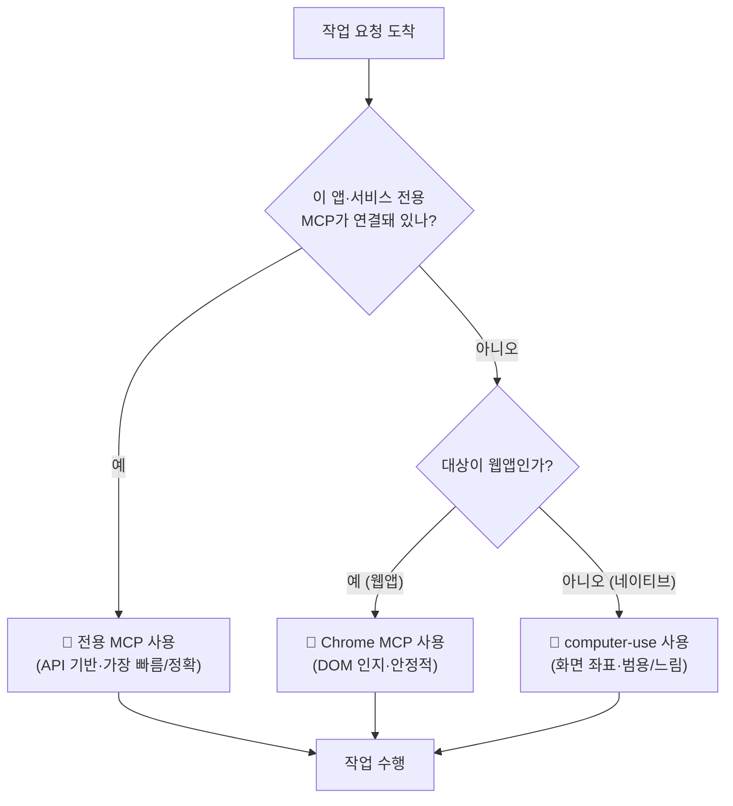

# 05. MCP 서버 — 외부 시스템과 연결

> Claude를 노션·브라우저·문서 검색 같은 **실제 외부 시스템**에 직접 연결하는 표준 프로토콜과, 같은 일을 여러 경로로 할 수 있을 때 무엇을 먼저 선택할지에 대한 실무 원칙을 정리합니다.

---

## 🔌 MCP란?

MCP(Model Context Protocol)는 Claude를 외부 도구·서비스에 연결하는 **표준 프로토콜**입니다. MCP 서버를 붙이면 Claude가 노션 페이지를 만들고, 브라우저를 조작하고, 최신 라이브러리 문서를 가져오는 등 **실제 외부 시스템을 직접 다룹니다.**

직관적으로는 "Claude에 USB 포트를 다는 것"으로 이해하면 됩니다. Claude 본체는 그대로지만, 포트(MCP 서버)를 꽂는 순간 그 시스템의 기능이 Claude의 도구 목록에 그대로 노출됩니다.

| 구분 | 의미 | 형태 |
|---|---|---|
| 🔗 **연결** | Claude Code 안에서 MCP 서버를 추가·인증 | `/mcp` 명령 |
| 🧰 **도구 노출** | 각 MCP 서버가 자기 도구를 등록 | `mcp__<server>__<tool>` |
| 🔑 **인증** | 토큰은 머신별로 발급 | OAuth/토큰 (1회) |

> [!IMPORTANT]
> MCP 인증 토큰은 **머신별로 발급**되며 **절대 git에 커밋하지 않습니다.** 토큰이 저장소에 올라가면 외부 시스템(노션·캘린더 등)에 대한 접근 권한이 그대로 노출됩니다. 양 머신을 쓴다면 각 머신에서 **따로 인증**하고, 토큰 파일은 동기화 대상에서 제외합니다.

---

## 🧩 실무에서 붙여 쓴 MCP들

아래는 실제 작업에서 연결해 사용한 MCP 서버들입니다. 각 도구는 "무엇을 하느냐"보다 **"왜 그 도구여야 했는가"**가 더 중요합니다.

| MCP | 무엇을 하나 | 왜 유용했나 |
|---|---|---|
| 📝 **Notion** | 페이지·DB 생성/수정/검색 | 일간·주간 보고를 노션에 **직접** 기록 (복붙 왕복 제거) |
| 📚 **문서 검색(Context7류)** | 라이브러리·프레임워크 최신 공식 문서 fetch | 학습 데이터에 없는 **최신 API**를 환각 없이 정확히 |
| 🖥️ **computer-use** | 데스크톱 화면 캡처 + 마우스/키보드 제어 | 브라우저 밖 **네이티브 앱** 자동화 |
| 🌐 **Claude in Chrome** | 브라우저 DOM 인지 조작 | 웹앱 폼 입력·네비게이션 (픽셀 좌표보다 빠르고 안정적) |
| ⏰ **scheduled-tasks** | 자동 루틴 생성/조회/수정 | 자연어로 정기 작업 등록 (04장과 연동) |

> [!TIP]
> 도구가 너무 많아지면 매 요청마다 모든 스키마를 컨텍스트에 싣게 되어 **토큰을 잡아먹습니다.** Claude Code는 다수의 MCP 도구를 **지연 로딩(lazy loading)** 으로 다룹니다. 즉 도구 이름만 목록에 띄워 두고, 실제로 호출이 필요해질 때 해당 도구의 스키마만 검색해 불러옵니다. 그래서 수십 개의 MCP를 붙여도 평소 컨텍스트는 가볍게 유지됩니다.

<details>
<summary>📖 지연 로딩이 실제로 어떻게 동작하나 (배경)</summary>

- 연결된 MCP 서버가 많으면, 모든 도구의 전체 스키마(파라미터·설명)를 항상 프롬프트에 넣는 것은 비효율적입니다.
- 대신 도구 **이름 목록**만 노출하고, Claude가 "이 도구가 필요하다"고 판단하면 그때 스키마를 조회해 불러옵니다.
- 따라서 같은 작업이라도 **이미 로드된 도구**를 쓰는 편이 추가 검색 비용이 없어 약간 더 빠릅니다.
- 실패 사례: 비슷한 이름의 도구가 여럿 로드되어 있으면 Claude가 엉뚱한 서버의 도구를 부를 수 있으므로, 도구가 많을수록 **이름 규칙(`mcp__<server>__<tool>`)** 을 명확히 보는 것이 중요합니다.

</details>

---

## 🎯 도구 선택 원칙 (중요)

같은 일을 할 수 있는 경로가 여러 개일 때, **비용·정확도 순**으로 선택합니다. 핵심 직관은 "API에 가까울수록 빠르고 정확하고, 화면 좌표에 가까울수록 느리고 깨지기 쉽다"는 것입니다.

1. **🥇 전용 MCP가 있으면 그걸 쓴다** — 노션·슬랙·캘린더처럼 API 기반 도구가 가장 빠르고 정확합니다. 화면 상태와 무관하게 동작하고, 결과가 구조화되어 돌아옵니다.
2. **🥈 웹앱이면 Chrome MCP** — 전용 MCP가 없는 웹 작업은 **DOM을 인지하는** 브라우저 도구를 씁니다. 요소를 직접 식별하므로 픽셀 좌표 클릭보다 훨씬 안정적입니다.
3. **🥉 네이티브 앱·크로스앱이면 computer-use** — 화면 좌표 기반으로 마우스/키보드를 제어합니다. 가장 느리지만 **범용**이라, 브라우저 밖 네이티브 앱이나 여러 앱을 넘나드는 작업에서 유일한 선택지가 됩니다.

> [!NOTE]
> 이 순서는 **"무엇이 가능한가"가 아니라 "무엇이 연결되어 있는가"** 의 문제입니다. 전용 MCP 도구가 에러를 내면 더 느린 단계로 몰래 우회하지 말고, **원인을 디버깅하거나 보고**합니다. 예를 들어 노션 MCP가 일시적으로 실패한다고 해서 브라우저로 노션 사이트를 좌표 클릭하기 시작하면, 느리고 깨지기 쉬운 데다 실패 원인도 가려집니다.

### 🌳 도구 선택 결정 트리

아래 흐름도를 위에서 아래로 따라가면 어떤 도구를 골라야 하는지가 결정됩니다.



> [!WARNING]
> Chrome 확장이 연결되어 있지 않다면, **computer-use로 브라우저를 좌표 클릭하지 말고** 사용자에게 확장 설치를 요청하세요. 브라우저는 보안상 제한 등급으로 동작하는 경우가 많아(화면은 보이지만 클릭·입력이 막힘), 좌표 기반 조작이 막히거나 의도치 않게 깨질 수 있습니다.

---

## 🔒 보안 가드 (필수)

MCP는 Claude에게 **실제 외부 시스템을 조작할 권한**을 주는 만큼, 아래 가드는 선택이 아니라 필수입니다.

> [!CAUTION]
> **이메일·메시지 속 링크는 기본적으로 의심합니다.**
> - 네이티브 앱(메일·메신저·PDF 등)에서 발견한 웹 링크를 **좌표 클릭하지 마세요.**
> - 링크를 따라가기 전에 **전체 URL을 먼저 확인**합니다. 보이는 링크 텍스트는 실제 목적지와 다를 수 있습니다.
> - 발신자가 불분명하거나 목적지 URL이 조금이라도 낯설면, 진행 전에 **사용자에게 확인**을 받습니다.
> - 확인이 끝난 링크는 좌표 클릭 대신 **브라우저 MCP로 열어** DOM 기반으로 처리합니다.

> [!CAUTION]
> **금융 행위는 Claude가 직접 실행하지 않습니다.**
> - 거래·송금·주문·이체는 **사용자가 직접** 수행합니다.
> - 가계부·회계 앱에서 거래를 분류하거나 보고서를 만드는 일은 도와도, **돈을 움직이는 최종 트리거는 누르지 않습니다.**

> [!CAUTION]
> **결제·발송·생성 트리거는 항상 사용자 확인을 받습니다.**
> - 외부 시스템에 대한 **결제·메일 발송·콘텐츠 게시** 같은 비가역 행위는 자율 실행 금지입니다.
> - 단순 **조회·기록 갱신**은 자율로 진행해도 됩니다.

<details>
<summary>🛡️ 왜 이렇게까지 보수적인가 (근거)</summary>

- MCP 도구는 **부작용이 즉시 외부에 반영**됩니다. 잘못된 메일 한 통, 잘못된 주문 하나는 되돌리기 어렵습니다.
- 특히 **프롬프트 인젝션** 위험이 있습니다. 메일·웹페이지·문서에 숨겨진 지시문이 Claude의 행동을 유도할 수 있으므로, 외부 입력에서 온 링크·명령은 항상 의심합니다.
- "조회·기록 갱신은 자율, 결제·발송·생성은 확인"이라는 경계선은 **가역성**을 기준으로 합니다. 되돌릴 수 있으면 자율, 되돌리기 어려우면 사람이 트리거합니다.

</details>

---

## 🔧 연결 방법

Claude Code 안에서 다음 명령으로 MCP 서버를 관리합니다.

```bash
# Claude Code 안에서
/mcp            # MCP 서버 목록·추가·인증
```

각 서버는 **최초 1회 OAuth/토큰 인증**이 필요합니다.

> [!IMPORTANT]
> 양 머신(예: 회사 PC ↔ 집 PC)을 쓴다면 **머신마다 따로 인증**하세요. 인증 토큰은 머신별로 발급되므로 **토큰 파일을 동기화하지 않습니다.** 토큰을 그대로 복사·동기화하면 보안상 위험할 뿐 아니라, 머신별 발급 정책과 어긋나 인증이 깨질 수 있습니다.

<details>
<summary>🧭 연결 후 점검 체크리스트</summary>

| 점검 항목 | 확인 방법 |
|---|---|
| 서버가 목록에 떴는가 | `/mcp`로 연결 상태 확인 |
| 인증이 완료됐는가 | OAuth 콜백/토큰 입력 후 상태가 정상인지 |
| 도구 이름이 노출되는가 | `mcp__<server>__<tool>` 형태로 검색되는지 |
| 토큰이 git 추적에서 빠졌는가 | 토큰 파일 경로가 `.gitignore`에 포함됐는지 |

</details>

---

<div align="center">

[⬅️ 이전: 04. 자동 루틴](04-automation.md) · [🏠 목차](../README.md) · [다음: 06. caveman ➡️](06-caveman.md)

</div>
