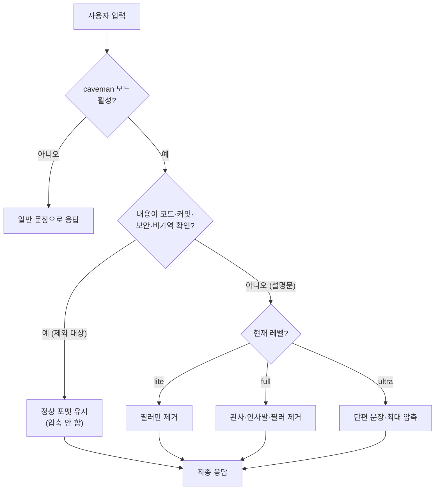
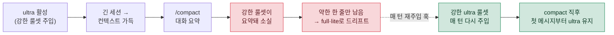

# 06. caveman — 토큰 압축 응답 모드

## 🗿 caveman이란?

`caveman`은 Claude의 응답을 "원시인 말투"처럼 압축하여, **기술적 내용은 그대로 보존하면서 군더더기(관사·인사말·헤지 표현·필러)만 제거**하는 플러그인입니다. 같은 작업을 더 적은 토큰으로 처리할 수 있어, 긴 세션에서 비용과 지연을 줄이는 데 효과적입니다.

핵심 아이디어는 단순합니다. LLM의 자연어 출력 중 상당 부분은 정보가 아니라 "예의"입니다. "물론입니다, 기꺼이 도와드리겠습니다", "이 부분은 다소 복잡할 수 있지만" 같은 문장은 사람에게는 친절하지만, 토큰 단위로 비용이 매겨지는 환경에서는 순수한 낭비입니다. caveman은 이 잡음을 걷어내고 신호만 남깁니다.

> [!NOTE]
> caveman은 **출력 스타일(output style)** 만 바꾸는 모드입니다. Claude의 추론 능력이나 도구 사용 방식 자체를 바꾸지는 않습니다. 즉, 답변의 "정확도"가 아니라 "표현 길이"를 줄이는 것이 본질입니다.

| 항목 | 내용 |
|:---|:---|
| 📦 출처 | 마켓플레이스 `<github-user>/caveman` ([github.com/<github-user>/caveman](https://github.com/<github-user>/caveman)) |
| ⚙️ 설치 | `settings.json`의 `extraKnownMarketplaces` + `enabledPlugins`로 활성화 |
| 🔀 전환 | `/caveman lite|full|ultra` |
| 🛑 해제 | `"stop caveman"` / `"normal mode"` |

---

## 📊 강도(레벨) — 압축 강도 표

caveman은 압축 강도를 세 단계로 제공합니다. 작업의 성격과 협업자의 가독성 요구에 맞춰 선택합니다.

| 레벨 | 압축 강도 | 제거 대상 | 예상 절감 | 권장 용도 |
|:---|:---:|:---|:---:|:---|
| 🟢 `lite` | 약함 | 명백한 필러만 | ~30% | 가독성을 유지하며 살짝 줄일 때 |
| 🟡 `full` | 기본 | 관사·필러·인사말 | ~50% | 일상적인 개발 세션 (기본값) |
| 🔴 `ultra` | 강함 | 문장을 단편(斷片)으로 | ~75% | 혼자 작업·최대 압축이 필요할 때 |

> [!TIP]
> 레벨은 세션 도중 언제든 바꿀 수 있습니다. 탐색 단계에서는 `ultra`로 빠르게 훑고, 결과를 동료와 공유할 문서로 정리할 때는 `lite` 또는 해제 상태로 전환하는 식의 운영이 실용적입니다.

### 같은 답변, 레벨별 비교 예시

아래는 동일한 의도의 답변이 레벨에 따라 어떻게 압축되는지를 보여 줍니다.

<details>
<summary>📝 레벨별 출력 비교 펼쳐 보기</summary>

**일반 모드 (압축 없음)**
> 네, 알겠습니다. `<config-file>` 파일의 47번째 줄에 있는 타임아웃 값이 너무 작게 설정되어 있는 것 같습니다. 이 값을 30초로 늘려 주시면 문제가 해결될 가능성이 높습니다.

**`lite`**
> `<config-file>` 47번 줄 타임아웃 값이 너무 작습니다. 30초로 늘리면 해결될 가능성이 높습니다.

**`full`**
> `<config-file>`:47 타임아웃 너무 작음. 30초로 늘리면 해결.

**`ultra`**
> `<config-file>`:47 timeout↑ 30s. fix.

</details>

---

## 🚫 압축에서 제외되는 것 (중요)

압축은 어디까지나 "설명문"에만 적용됩니다. 의미가 한 글자라도 어긋나면 안 되는 영역은 압축하지 않고 **정상 문장·정상 포맷**으로 출력합니다.

> [!IMPORTANT]
> 다음 항목은 caveman 레벨과 무관하게 **항상 압축 제외** 대상입니다. 오해·오작동·사고를 막기 위한 안전장치입니다.
>
> - 🧩 **코드 / 명령어** — 들여쓰기, 변수명, 기호 하나까지 그대로. 압축하면 실행이 깨집니다.
> - 📌 **커밋 메시지 / PR 본문** — 형식과 의미가 협업 규약에 묶여 있습니다.
> - 🔐 **보안 경고** — "이 키가 노출됩니다" 같은 경고는 줄이면 위험이 전달되지 않습니다.
> - ⚠️ **비가역 작업 확인** — 삭제·덮어쓰기·배포처럼 되돌릴 수 없는 작업의 확인 문구.

이유는 명확합니다. 압축은 "사람이 읽고 이해하는 부분"을 짧게 만드는 기법인데, 위 항목들은 사람이 아니라 **기계가 그대로 실행**하거나 **위험을 정확히 인지**해야 하는 영역입니다. 한 토큰을 아끼려다 빌드를 깨뜨리거나 보안 사고를 흘려보내면, 절약한 비용보다 훨씬 큰 손실이 발생합니다.

---

## 🔄 동작 흐름

caveman이 응답을 만들 때 거치는 판단 흐름은 다음과 같습니다. 핵심은 "압축 제외 대상인지 먼저 가른다"는 점입니다.



> [!NOTE]
> 위 흐름에서 가장 먼저 갈리는 분기가 "압축 제외 대상인가"입니다. 레벨 판단(`lite`/`full`/`ultra`)은 그 뒤에 옵니다. 즉, `ultra` 모드라 하더라도 코드 블록은 절대 압축되지 않습니다.

---

## 🔁 compact 후에도 ultra가 풀리는 문제 — 매 턴 재주입 훅

긴 세션에서 컨텍스트가 차면 `/compact`(또는 자동 compact)로 대화를 요약해 공간을 확보합니다. 그런데 이때 **`ultra`가 슬그머니 `full`·`lite` 수준으로 약해지는** 현상이 생깁니다.

**원인**: caveman 플러그인은 강한 전체 룰셋을 **`SessionStart` 훅에서 한 번** 주입합니다. 이 텍스트는 결국 "대화 내용"의 일부이므로, compact가 대화를 요약할 때 **함께 잘려 나갑니다.** compact 직후 남는 caveman 신호는 매 입력마다 붙는 **약한 한 줄짜리 리마인더**뿐이라, 강한 압축을 지시하던 앵커가 사라지고 응답이 점점 길어집니다.



**해결**: `SessionStart`(세션당 1회) 대신 **`UserPromptSubmit`(매 입력)** 에 강한 `ultra` 룰셋을 재주입하는 훅을 둡니다. 매 턴 도므로 **compact 직후 첫 메시지부터** 다시 앵커가 박히고, 세션 중간에 서서히 풀리는 드리프트까지 함께 잡힙니다. CC 버전이 compact 시 `SessionStart`를 다시 호출하는지 여부와 무관하게 동작하는 것도 장점입니다.

> [!IMPORTANT]
> 이 훅은 플러그인이 기록하는 **flag 파일(`<홈>/.claude/.caveman-active`)** 을 읽어 **현재 모드가 정확히 `ultra`일 때만** 룰셋을 내보냅니다. `lite`·`full`이거나 `"stop caveman"`으로 해제(flag 삭제)된 상태면 아무것도 출력하지 않으므로, 다른 레벨·해제 동작을 방해하지 않습니다.

**장점**:
- compact 후에도 `ultra` 강도가 유지됨 → `/caveman ultra`를 매번 다시 칠 필요 없음
- 세션 중간 드리프트(긴 대화에서 점점 길어지는 현상)도 함께 억제
- flag 게이팅으로 `off`/`lite`/`full`은 그대로 — 부작용 없음
- 플러그인 소스가 아니라 **사용자 훅**이라 플러그인 업데이트에도 살아남음

**주의**:
- 매 턴 ~100토큰의 룰셋이 주입됩니다(프롬프트 캐시로 비용은 작음). `ultra`가 응답마다 아끼는 양이 더 크므로 순이득이지만, 토큰을 극한까지 아껴야 하는 상황이라면 인지해 둘 값입니다.
- caveman을 안 쓰는 환경에는 불필요합니다. flag가 `ultra`가 아니면 즉시 빠져나가므로(거의 무비용) 켜 두어도 무방하지만, 필요 없으면 등록하지 않으면 됩니다.

→ [examples/hooks/caveman-reinforce-ultra.js](../examples/hooks/caveman-reinforce-ultra.js) · 등록 방법은 [01. 훅 — 훅 6](01-hooks.md) 참고

---

## 💡 왜 사용하나

- **비용·속도** — 긴 세션에서 출력 토큰이 누적되면 비용과 응답 지연이 함께 커집니다. 군더더기를 줄이면 같은 정보를 더 빠르고 저렴하게 전달할 수 있습니다.
- **신호 대 잡음(S/N) 향상** — "물론이죠! 기꺼이 도와드리겠습니다…" 같은 빈말을 제거하면, 단위 토큰당 실제 정보 밀도가 올라갑니다. 스크롤을 덜 내려도 핵심이 보입니다.
- **컨텍스트 수명 연장** — 응답이 짧아지면 같은 컨텍스트 윈도우 안에 더 많은 대화를 담을 수 있습니다. 특히 장시간 디버깅·탐색 세션에서 체감 효과가 큽니다.

> [!TIP]
> caveman은 "항상 켜 두는 모드"가 아니라 "상황에 맞춰 켜는 도구"로 보는 편이 좋습니다. 빠른 반복 작업·혼자 하는 탐색에는 강하게, 공유 문서·온보딩 설명에는 끄거나 약하게 — 이렇게 선택적으로 쓰는 것이 가장 효율적입니다.

---

## 🧰 함께 들어오는 것들

caveman 마켓플레이스는 압축 모드 외에도 유용한 서브 도구를 함께 제공합니다.

### 🤖 cavecrew 서브에이전트

출력을 압축해 메인 스레드로 돌려주는 전문 에이전트입니다. 서브에이전트 결과가 caveman 포맷으로 압축되어 주입되므로, 메인 컨텍스트를 **약 60% 절약**할 수 있습니다.

| 에이전트 | 역할 | 출력 형태 |
|:---|:---|:---|
| 🔍 `cavecrew-investigator` | 읽기 전용 코드 위치 탐색 | `파일:라인` 표 |
| 🔨 `cavecrew-builder` | 1~2개 파일의 외과적 수정 | 변경 요약 |
| 👁️ `cavecrew-reviewer` | diff / 브랜치 리뷰 | 한 줄/지적 코멘트 |

### 🛠️ 보조 명령

| 도구 | 기능 |
|:---|:---|
| `caveman-commit` | 압축된 Conventional Commits 메시지 생성 |
| `caveman-review` | 한 줄/지적식 PR 리뷰 코멘트 작성 |
| `caveman-compress` | 메모리 파일(`CLAUDE.md` 등)을 caveman 포맷으로 압축(입력 토큰 절감) |
| `caveman-stats` | 세션의 실제 토큰 사용량·절감 추정치 표시 |

> [!CAUTION]
> `caveman-compress`는 메모리 파일을 **덮어쓰는** 도구입니다. 사람이 읽기 어려운 압축본으로 바뀌므로, 실행 전 원본 백업(예: `<file>.original.md`)이 남는지 확인하세요. 협업자가 함께 보는 파일이라면 압축이 가독성을 해칠 수 있다는 점도 고려해야 합니다.

---

## ⚙️ 설정 예시

```jsonc
{
  "extraKnownMarketplaces": {
    "caveman": {
      "source": { "source": "github", "repo": "<github-user>/caveman" }
    }
  },
  "enabledPlugins": { "caveman@caveman": true },
  "statusLine": {
    "type": "command",
    "command": "powershell -NoProfile -ExecutionPolicy Bypass -File \"<caveman-cache>\\caveman-statusline.ps1\""
  }
}
```

<details>
<summary>🪟 Windows·한국어 환경 추가 주의</summary>

- `statusLine`의 PowerShell 스크립트 경로에 한글이 포함되면, 인코딩 문제로 깨질 수 있습니다. 경로는 가급적 ASCII로 유지하거나 `<caveman-cache>` 같은 placeholder가 가리키는 실제 경로를 직접 확인하세요.
- 스크립트 파일 자체에 한글 문자열이 있다면 **UTF-8 BOM**으로 저장해야 CP949로 오해석되지 않습니다.
- 콘솔에서 상태줄이 깨져 보여도 파일 자체는 정상일 수 있습니다. 코드페이지(`chcp`) 문제와 파일 인코딩 문제를 구분해서 진단하세요.

</details>

---

## ⚠️ 주의사항

> [!WARNING]
> caveman은 **외부 플러그인**입니다. 활성화하기 전에 다음을 반드시 점검하세요.
>
> - 📜 **출처·라이선스 확인** — 저장소(`<github-user>/caveman`)의 라이선스가 본인·조직 정책에 맞는지 확인합니다. 코드 비공개 정책을 쓴다면 GPL·AGPL 계열 라이선스와의 충돌 여부를 먼저 검토해야 합니다.
> - 🔎 **코드 실행 신뢰성** — 플러그인은 상태줄 스크립트 등 임의 코드를 실행할 수 있습니다. 활성화 전에 저장소 내용을 직접 확인하고, 신뢰할 수 있는 버전(태그/커밋)을 고정하는 것이 안전합니다.
> - 🔐 **자격증명 노출 금지** — 설정 파일에 토큰·키 같은 실제 값을 직접 적지 말고, 환경 변수나 placeholder로 분리하세요.

> [!CAUTION]
> 압축이 과하면 협업자가 읽기 불편할 수 있습니다. **공유 산출물(문서·PR 설명·보고서)은 정상 문장으로** 작성하는 것을 원칙으로 하고, caveman은 개인 작업 흐름에서만 활용하는 것을 권장합니다.

---

<div align="center">

[⬅️ 이전: 05. MCP](05-mcp.md) · [🏠 목차](../README.md) · [다음: 07. 설정·백업 ➡️](07-settings-backup.md)

</div>
