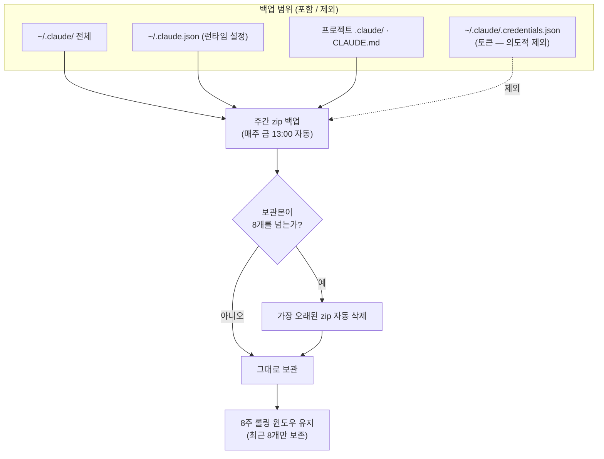

# 07. ⚙️ 설정(settings.json) · 상태줄 · 백업

이 문서는 Claude Code 환경의 동작을 정의하는 `settings.json`, 화면 하단에 정보를 띄우는 상태줄(statusLine), 그리고 설정 자산을 지키는 주간 백업 체계를 다룹니다. 핵심 목표는 단 하나입니다. **언제든 환경을 그대로 재현할 수 있게 만드는 것**입니다.

> [!NOTE]
> 설정·메모리·스킬은 한 번 만들고 끝나는 파일이 아니라 시간이 갈수록 가치가 누적되는 자산입니다. 그래서 "어떻게 정의하는가"만큼이나 "어떻게 잃지 않는가"가 중요합니다. 이 문서는 두 측면을 함께 설명합니다.

---

## 🗂️ settings.json — 환경의 단일 진실

`<HOME>/.claude/settings.json`은 훅·플러그인·상태줄·테마·자동업데이트 등 Claude Code 동작 전반을 한곳에서 정의하는 파일입니다. 동작을 좌우하는 스위치가 여기 모여 있기 때문에, 이 파일 하나로 환경을 재현할 수 있도록 관리하는 것이 셋업 전체의 출발점입니다.

> [!TIP]
> 설정을 여기저기 흩뜨리지 말고 `settings.json`에 모으면, 새 머신을 세팅할 때 이 파일 하나만 옮겨도 대부분의 동작이 그대로 따라옵니다. "설정이 어디 있더라"를 찾아 헤매는 비용이 사라지는 것이 가장 큰 이점입니다.

### 🔑 이 셋업에서 켠 주요 항목

| 항목 | 값 | 이유 |
|---|---|---|
| 🪝 `hooks` | 6종 등록 | 안전·맥락 자동화 ([01-hooks.md](01-hooks.md)) |
| 🏪 `extraKnownMarketplaces` | caveman 마켓 등록 | 커스텀 플러그인 소스 ([10-plugins-marketplaces.md](10-plugins-marketplaces.md)) |
| 📊 `statusLine` | caveman 상태줄 | 현재 모드/토큰 상태 표시 |
| 🎨 `theme` | `dark` | 어두운 환경에서의 가독성 |
| 🔄 `autoUpdatesChannel` | `latest` | 최신 기능·수정 사항 추적 |
| 🧩 `enabledPlugins` | `caveman@caveman` | 토큰 압축 ([06-caveman.md](06-caveman.md)) |
| 🔔 `inputNeededNotifEnabled` | `true` | 입력이 필요할 때 알림(자리를 비울 때 유용) |
| 🔔 `agentPushNotifEnabled` | `true` | 에이전트 작업 완료 시 푸시 알림 |
| 🛰️ `remoteControlAtStartup` | `true` | 시작 시 원격 제어 활성화 |
| 🔕 `skipWorkflowUsageWarning` | `true` | 워크플로 사용량 경고 대화상자 생략(UX) |

전체 예시는 저장소의 [examples/settings.json](../examples/settings.json)에서 확인할 수 있습니다.

> [!IMPORTANT]
> 위 표의 값은 "이 셋업이 선택한 기본값"이며 정답이 아닙니다. 예를 들어 알림(`inputNeededNotifEnabled` 등)은 자리를 자주 비우는 워크플로에서 진가를 발휘하지만, 한 화면 앞에서만 작업한다면 오히려 소음이 될 수 있습니다. 각 항목은 자신의 작업 방식에 맞춰 켜고 끄는 것이 맞습니다.

<details>
<summary>📄 settings.json 최소 형태 예시 (placeholder)</summary>

```jsonc
{
  // 화면 하단 상태줄 — 어떤 스크립트든 붙일 수 있는 명령형
  "statusLine": {
    "type": "command",
    "command": "<상태줄 스크립트 경로>"
  },

  // 자동화 훅 (자세한 내용은 01-hooks.md)
  "hooks": {
    "SessionStart": [ /* ... */ ],
    "PreToolUse": [ /* ... */ ]
  },

  // 외형 / 업데이트
  "theme": "dark",
  "autoUpdatesChannel": "latest",

  // 플러그인 — "<플러그인>@<마켓플레이스>": true 객체 형식
  "enabledPlugins": { "caveman@caveman": true },

  // 알림 / 원격
  "inputNeededNotifEnabled": true,
  "agentPushNotifEnabled": true,
  "remoteControlAtStartup": true
}
```

> 경로·식별자는 머신마다 다르므로 `<...>` placeholder로 표기했습니다. 실제 값은 각자의 환경에 맞춰 채웁니다.

</details>

---

## 🔁 settings.json vs settings.local.json

같은 폴더에 비슷한 이름의 두 파일이 있습니다. 둘의 역할을 헷갈리면 동기화 사고로 직결되므로, 경계를 명확히 알아 두는 것이 중요합니다.

| 구분 | 📦 `settings.json` | 🔒 `settings.local.json` |
|---|---|---|
| 성격 | 공유 가능한 공통 설정 | 머신별 고유 설정 |
| 대표 내용 | 훅 등록, 플러그인, 테마, 알림 | 로컬 경로, 머신별 권한, 환경 의존 값 |
| 예시 | `enabledPlugins`, `hooks`, `theme` | 해당 머신의 인터프리터 경로(`<python_path>`) 등 |
| 머신 간 공통? | ✅ 공통 (동기화 OK) | ❌ 머신마다 다름 |
| git 동기화 | ✅ 추적·커밋 | 🚫 **동기화 제외** |
| 잃었을 때 | 저장소에서 복원 가능 | 해당 머신에서 다시 설정 필요 |

> [!WARNING]
> `settings.local.json`을 실수로 공유 대상에 올리면, 한 머신의 절대 경로나 권한이 다른 머신으로 흘러 들어가 **그 머신에서만 설명되지 않는 오작동**이 생깁니다. "왜 회사 PC에선 되는데 집에선 안 되지?"의 흔한 원인이 바로 이것입니다. 로컬 파일은 반드시 동기화 대상에서 제외하세요. (동기화 구성은 [08-sync-infra.md](08-sync-infra.md) 참고)

> [!TIP]
> 판단이 헷갈릴 때의 기준은 단순합니다. **"다른 머신에 그대로 옮겨도 말이 되는가?"** 말이 되면 `settings.json`, 그 머신에서만 의미가 있으면 `settings.local.json`입니다.

---

## 📊 상태줄(statusLine)

상태줄은 화면 하단에 커스텀 정보를 띄우는 영역입니다. 이 셋업에서는 caveman 플러그인의 상태줄 스크립트를 붙여 **현재 압축 모드와 세션 상태**를 항상 눈에 보이게 했습니다. 모드가 바뀌었는지 화면을 떠나지 않고 즉시 확인할 수 있다는 것이 장점입니다.

상태줄은 명령형(`type: "command"`)이라서, 출력 한 줄을 내놓는 스크립트라면 무엇이든 붙일 수 있습니다.

```jsonc
"statusLine": {
  "type": "command",
  "command": "<상태줄 스크립트 경로>"
}
```

활용 예시는 다양합니다.

- 🌿 현재 git 브랜치 표시
- 🔢 토큰 사용량 / 압축 모드 표시
- 🕒 마지막 백업 경과일 같은 운영 신호 표시

> [!NOTE]
> 상태줄 스크립트는 매 갱신마다 호출되므로 **가볍고 빨라야** 합니다. 네트워크 호출이나 무거운 연산을 넣으면 상태줄이 화면 갱신을 지연시킬 수 있으니, 로컬에서 즉시 끝나는 정보만 넣는 것이 좋습니다.

---

## 💾 주간 백업 — 설정 유실 방지

앞서 말했듯 설정·메모리·스킬은 시간이 쌓일수록 자산이 되고, 한 번 날아가면 복구 비용이 큽니다. 그래서 이 셋업은 **주 1회 zip 백업**을 자동화했습니다. 사람이 기억해서 누르는 백업은 결국 잊히기 때문에, 자동화가 핵심입니다.

### 📦 백업 범위 (포함 / 제외)

| 대상 | 포함 여부 | 비고 |
|---|---|---|
| `<HOME>/.claude/` 전체 | ✅ 포함 | 설정·메모리·스킬·훅 일체 |
| `<HOME>/.claude/.credentials.json` | ❌ **제외** | 토큰 유출 방지 (의도적 제외) |
| `<HOME>/.claude.json` | ✅ 포함 | 런타임 설정 |
| 각 프로젝트의 `.claude/` | ✅ 포함 | 프로젝트별 설정 |
| 각 프로젝트의 `CLAUDE.md` | ✅ 포함 | 프로젝트 메모리 |

> [!CAUTION]
> `.credentials.json`은 로그인 토큰을 담고 있습니다. 만약 이 파일을 백업 zip에 함께 넣으면, **백업본이 어딘가로 새는 순간 인증 토큰까지 함께 새어 나갑니다.** 그래서 다른 모든 것을 백업하면서도 이 파일 하나만은 일부러 제외합니다. 편의가 아니라 보안 결정입니다.

### 🔄 보관 정책 — 8주 롤링

백업은 **최근 8개의 zip만 유지**하고, 그보다 오래된 백업은 자동으로 삭제합니다. 주 1회 백업이므로 8개는 곧 약 8주분에 해당합니다.



> [!IMPORTANT]
> **왜 이렇게 설계했는가**를 정리하면 다음과 같습니다.
> - 🔒 **자격증명 제외** — 백업 zip이 새더라도 인증 토큰은 새지 않도록, `.credentials.json`만 일부러 빼 둡니다.
> - ♻️ **8주 롤링** — 무한히 쌓여 디스크를 잠식하는 것을 막으면서도, 한참 전의 설정으로 되돌아갈 수 있는 충분한 복구 창을 남깁니다.
> - 👀 **백업 정지 감지** — 세션 시작 훅이 "마지막 백업 N일 전 ⚠️"를 표시하므로, 어떤 이유로 백업이 멈추면 사람이 바로 알아챕니다. 조용히 멈춰 있다가 정작 필요할 때 백업이 없는 사고를 예방합니다.

### ⏰ 등록 (스케줄러)

플랫폼별 스케줄러에 백업 스크립트를 같은 시각(매주 금 13:00)에 등록합니다.

| 플랫폼 | 등록 방법 | 작업 이름 / 형식 |
|---|---|---|
| 🪟 Windows | 작업 스케줄러 | `<백업 작업 이름>` 작업으로 매주 금 13:00 실행 |
| 🍎 macOS | `launchd` plist | 동일 시각으로 plist 등록 |

> [!WARNING]
> 작업 스케줄러나 `launchd`에 항목을 등록하는 것은 **시스템 설정 변경**에 해당합니다. 자동으로 밀어붙이지 말고, 등록 내용을 직접 확인하면서 진행하세요. 잘못 등록된 스케줄은 조용히 실패하거나 의도치 않은 시각에 동작할 수 있습니다.

---

## 🔧 복구

복구 절차는 단순합니다. 백업 zip을 풀어 `<HOME>/.claude/`에 덮어쓰면 됩니다.

```bash
# 1) 백업 zip 압축 해제
unzip <백업파일.zip> -d <복구_임시폴더>

# 2) ~/.claude/ 에 덮어쓰기
cp -r <복구_임시폴더>/.claude/* <HOME>/.claude/

# 3) Claude Code 첫 실행 → 재로그인
claude
```

> [!CAUTION]
> 백업에는 의도적으로 `.credentials.json`이 **들어 있지 않습니다.** 따라서 복구만으로는 인증이 따라오지 않으며, 복구 후 `claude`를 처음 실행할 때 **재로그인**해야 정상 동작합니다. "복구했는데 인증이 풀려 있다"는 버그가 아니라 설계대로의 동작입니다.

> [!TIP]
> 백업을 가끔 한 번씩 실제로 풀어 보면서 "이 zip만으로 환경이 정말 되살아나는가"를 점검하면 더 안전합니다. 한 번도 풀어 본 적 없는 백업은 정작 필요한 순간에 비어 있거나 손상돼 있어도 알 길이 없기 때문입니다.

---

<div align="center">

[⬅️ 이전: 06. caveman](06-caveman.md) · [🏠 목차](../README.md) · [다음: 08. 동기화 ➡️](08-sync-infra.md)

</div>
