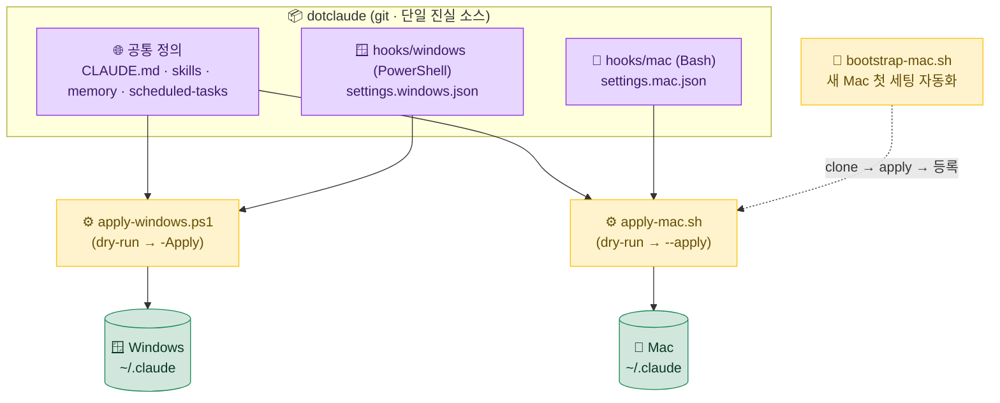
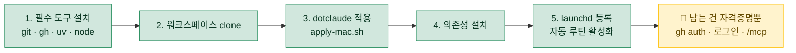

# 🔄 08. 양 머신 동기화 — 회사 Windows ↔ 집 Mac

> [!NOTE]
> 어느 컴퓨터에서 Claude Code를 켜도 **같은 글로벌 지침·스킬·메모리·훅·자동 루틴**이 따라오게 만드는 패턴입니다.
> 핵심은 단 하나 — **portable한 정의는 git으로 동기화하고, 자격증명·런타임 상태는 절대 동기화하지 않는다.**

---

## 🧩 문제 — OS가 다르면 무엇이 어긋나는가

회사에서는 Windows, 집에서는 Mac을 씁니다. 어느 컴퓨터에서 Claude Code를 켜도 같은 환경이 보장되어야 하는데, 두 가지 근본적인 장벽이 있습니다.

| 장벽 | 구체적 증상 | 왜 문제인가 |
|---|---|---|
| 🖥️ **OS별 훅 언어 차이** | Windows는 PowerShell(`.ps1`), Mac은 Bash(`.sh`)로 훅을 작성해야 함 | 같은 `settings.json`을 양쪽에 그대로 복사하면 한쪽에서 훅이 실행되지 않음 |
| 🔐 **동기화하면 안 되는 항목 혼재** | 자격증명(토큰)·머신별 런타임 상태가 설정 디렉토리에 섞여 있음 | 통째로 git에 올리면 **토큰 유출** 또는 머신 간 상태 충돌 발생 |

> [!WARNING]
> `~/.claude/` 디렉토리를 **통째로 git에 올리는 것은 위험**합니다. `.credentials.json`(로그인 토큰)이나 `~/.claude.json`(머신별 런타임 상태)이 함께 커밋되어, 토큰 유출이나 머신 간 상태 덮어쓰기로 이어집니다. 무엇을 올리고 무엇을 뺄지 **선별이 핵심**입니다.

---

## 🗂️ 해법 — `dotclaude` 패턴

설정을 git 저장소(`dotclaude/`)에 모아두고, **OS별 `apply` 스크립트**가 현재 머신의 올바른 위치로 복사·분기합니다. 정의는 한 저장소에 모이고, 적용은 OS를 인식해서(OS-aware) 갈라집니다.

```
dotclaude/
├── CLAUDE.md                 # 글로벌 지침 (OS 무관)
├── skills/                   # 커스텀 스킬 (OS 무관)
├── scheduled-tasks/          # 자동 루틴 정의 (OS-agnostic화)
├── memory/                   # portable 메모리
├── hooks/
│   ├── windows/              # PowerShell 훅
│   └── mac/                  # Bash 훅 (동등 동작)
├── settings/
│   ├── settings.windows.json # PowerShell 훅 경로로 분기
│   └── settings.mac.json     # Bash 훅 경로로 분기
├── launchd/                  # Mac 스케줄러 plist
└── scripts/
    ├── apply-windows.ps1     # Windows 적용 (dry-run → -Apply)
    ├── apply-mac.sh          # Mac 적용
    └── bootstrap-mac.sh      # Mac 첫 세팅 자동화(clone~등록)
```

> [!TIP]
> 디렉토리 이름은 자유롭게 바꿔도 됩니다(`<dotclaude>` 자리). 중요한 건 **이름이 아니라 구조** — "공통 정의 / OS별 훅 / OS별 settings / OS별 apply 스크립트"의 4층 분리입니다.

### 전체 흐름 한눈에 보기

`dotclaude`(git) 저장소에서 출발해, 각 OS의 `apply` 스크립트가 갈래를 타고 그 머신의 `~/.claude`로 풀려나가는 구조입니다.



---

## 🎯 동기화 범위 결정 (핵심)

이 패턴의 성패는 "무엇을 올리고 무엇을 뺄지"를 정확히 가르는 데 달려 있습니다.

### ✅ 동기화하는 것

| 항목 | 이유 |
|---|---|
| 🌐 글로벌 `CLAUDE.md` | OS와 무관한 순수 지침 |
| 🧩 스킬 | 작업 절차 정의 — 머신 독립적 |
| ⏰ 자동 루틴 정의(`scheduled-tasks/`) | 정의 자체는 portable (등록만 OS별) |
| 🧠 메모리 | 세션 넘어 유지되어야 할 맥락 |
| 🪝 훅(OS별 동등본) | Windows/Mac 각각의 언어로 **같은 동작**을 구현 |
| ⚙️ settings(OS별 분기) | `settings.windows.json` / `settings.mac.json` |
| 💾 백업 스크립트 | 환경 보존 로직 |
| 📁 프로젝트별 `CLAUDE.md`·스킬 | 프로젝트 단위 정의 |

### ❌ 동기화하지 않는 것 (이유)

| 항목 | 이유 | 대처 |
|---|---|---|
| `.credentials.json` | 🔥 토큰 유출 위험 | 머신마다 최초 로그인 |
| GitHub/MCP 토큰 | 🔐 자격증명 | `<gh-cli> auth login`, `/mcp` 인증 |
| 스케줄러 등록 | 🖥️ OS별 시스템 등록 | Mac은 bootstrap이 자동, Win은 수동 |
| `~/.claude.json` | 🔁 머신별 런타임 상태 | 동기화 안 함 |
| 세션 로그·snapshots·tasks·backups | 🗃️ 런타임 상태 | 동기화 안 함 |

> [!IMPORTANT]
> 가르는 단 하나의 기준 — **portable한 "정의"는 동기화, 자격증명·런타임 "상태"는 머신별.**
> "이 파일이 다른 머신에서 그대로 의미가 통하는가?"를 물어보세요. 토큰처럼 머신·세션에 묶인 값이면 ❌, 지침·스킬처럼 어디서나 같은 뜻이면 ✅입니다.

> [!CAUTION]
> `~/.claude.json`은 이름이 설정 파일처럼 보여 실수로 동기화하기 쉽습니다. 하지만 여기에는 **머신별 런타임 상태**(예: 마지막 세션 정보, 로컬 경로 캐시)가 들어 있어, 동기화하면 양쪽 머신이 서로의 상태를 덮어써 혼란이 생깁니다. **이름이 아니라 내용으로 판단하세요.**

---

## 🤔 왜 OS별 분기가 필요한가

훅은 OS마다 스크립트 언어가 다릅니다. 그래서 `settings`도 OS별로 갈라집니다.

- `settings.windows.json` → **PowerShell 훅 경로**를 가리킴
- `settings.mac.json` → **Bash 훅 경로**를 가리킴

`apply` 스크립트가 현재 OS에 맞는 버전을 골라 `~/.claude/settings.json`으로 깝니다. **정의는 한 저장소에 있지만, 적용은 OS-aware**라는 점이 이 패턴의 핵심입니다.

> [!TIP]
> **UTF-8 BOM 자동교정 훅처럼 Windows에만 필요한 훅**은 Windows 쪽(`hooks/windows/`)에만 둡니다. Mac에는 해당 인코딩 문제가 없으므로 Bash 동등본을 억지로 만들 필요가 없습니다. "동등 동작"의 목표는 *파일 1:1 미러링*이 아니라 *각 OS에서 같은 결과*입니다.

---

## 🔁 적용 흐름

한 머신에서 설정을 고치고, 다른 머신에서 받아 적용하는 일상적인 루프입니다.

```bash
# ── 1) 한 머신에서 설정 수정 → dotclaude로 옮기고 커밋 ──
cp -r ~/.claude/skills/<my-new-skill> dotclaude/skills/
git add dotclaude/ && git commit -m "feat(dotclaude): add <my-new-skill>" && git push

# ── 2) 다른 머신에서 받아서 적용 ──
git pull
cd dotclaude/scripts && ./apply-mac.sh --apply   # 또는 .\apply-windows.ps1 -Apply
```

> [!WARNING]
> 적용 스크립트는 항상 **dry-run(미리보기) → `-Apply`** 의 2단계로 실행하세요.
> 1단계 dry-run은 *무엇이 어디로 복사되고 무엇이 덮어써지는지*만 출력하고 실제 변경은 하지 않습니다. 내용을 눈으로 확인한 뒤에야 `-Apply`(Windows) / `--apply`(Mac)로 실제 적용하세요. 이 2단계 습관 하나가 **실수로 로컬 커스터마이즈를 덮어쓰는 사고**를 막습니다.

<details>
<summary>📋 2단계 적용이 막아주는 실제 실수 사례</summary>

- **로컬 전용 수정 유실** — 한 머신에서만 임시로 손본 훅이 있는데, dry-run 없이 바로 적용하면 그 변경이 조용히 덮어써집니다. dry-run 출력에 해당 파일이 "overwrite"로 찍히면 그때 멈추고 먼저 커밋하면 됩니다.
- **경로 오인** — `apply` 스크립트를 잘못된 작업 디렉토리에서 실행해 엉뚱한 위치에 깔리는 경우. dry-run의 대상 경로를 보면 즉시 알아챕니다.
- **OS 오선택** — Mac에서 실수로 Windows용 settings를 가리키는 경우. dry-run이 PowerShell 훅 경로를 출력하면 바로 이상함을 감지합니다.

</details>

---

## 🚀 Mac 첫 세팅 자동화

`bootstrap-mac.sh --apply` 한 번으로 새 Mac을 처음부터 끝까지 세팅합니다.

```bash
./bootstrap-mac.sh --apply
```

이 한 줄이 순서대로 수행하는 일은 다음과 같습니다.



> [!NOTE]
> 자동화가 끝나면 **수동으로 남는 일은 자격증명 발급뿐**입니다 — `<gh-cli> auth login`, `claude` 로그인, `/mcp` 인증. 이것들은 *구조적으로 동기화에서 빠진* 항목이라 새 머신에서 한 번씩 직접 발급하는 것이 정석입니다. 자동화가 못 해서가 아니라, **하면 안 되기 때문에** 남겨둔 것입니다.

---

## 💎 이 패턴의 가치

<table>
<tr>
<td width="33%" valign="top">

### 1️⃣ 이사 비용 제로화

새 머신에서 스크립트 **한 번**이면 동일 환경이 복원됩니다. 며칠에 걸쳐 설정을 손으로 맞추던 작업이 한 줄로 끝납니다.

</td>
<td width="33%" valign="top">

### 2️⃣ 단일 진실 소스

설정 변경은 **오직 dotclaude에서**. 양쪽 머신을 손으로 맞추다 생기는 **drift(설정 어긋남)**가 구조적으로 사라집니다.

</td>
<td width="33%" valign="top">

### 3️⃣ 구조적 안전

자격증명은 **설계 단계에서** 동기화 대상에서 빠집니다. "실수로 토큰을 커밋"하는 일이 *애초에 일어날 수 없는* 구조입니다.

</td>
</tr>
</table>

> [!IMPORTANT]
> 이 패턴이 주는 가장 큰 가치는 *편리함*이 아니라 **안전이 기본값(default)이 된다**는 점입니다. 자격증명을 빼는 것이 "조심해야 할 일"이 아니라 "구조상 그렇게 될 수밖에 없는 일"로 바뀝니다.

---

<div align="center">

[⬅️ 이전: 07. 설정·백업](07-settings-backup.md) · [🏠 목차](../README.md) · [다음: 09. 워크플로 ➡️](09-workflows.md)

</div>
