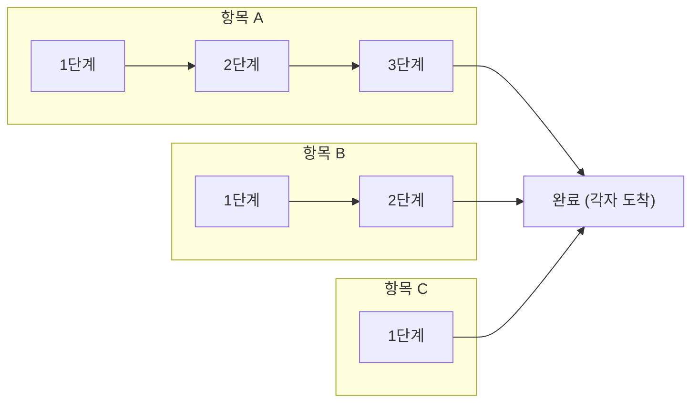
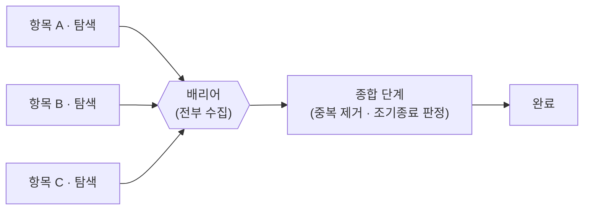
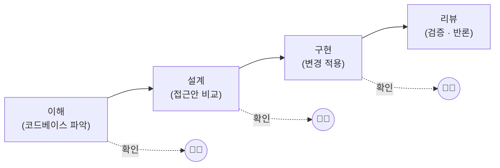

# 09. 멀티에이전트 워크플로 (ultracode)

> 큰 작업을 한 에이전트가 통째로 짊어지는 대신, 여러 서브에이전트로 **분산·검증·종합**하여 처리하는 오케스트레이션 계층입니다.

---

## 🧭 한눈에 보기

| 항목 | 내용 |
|---|---|
| 🎯 목적 | 단일 컨텍스트로는 버거운 작업을 여러 에이전트로 쪼개 동시에 처리하고 결과를 합칩니다 |
| 🛠️ 도구 | Claude Code의 Workflow 도구로 결정적(deterministic) 제어 흐름을 작성합니다 |
| 🔀 제어 흐름 | 루프(loop)·조건(condition)·팬아웃(fan-out)을 코드로 명시합니다 |
| ⚠️ 비용 | 수십 개 에이전트를 띄우므로 토큰 소모가 큽니다 — 필요할 때만 |
| 📌 호출 조건 | **사용자가 명시적으로 멀티에이전트를 요청했을 때만** |

---

## 🤔 무엇인가

큰 작업을 한 에이전트가 통째로 처리하는 대신, **여러 서브에이전트로 분산·검증·종합**하는 오케스트레이션입니다. Claude Code의 Workflow 도구로 결정적(deterministic) 제어 흐름(루프·조건·팬아웃)을 짭니다.

여기서 "결정적"이라는 표현이 핵심입니다. 일반적인 에이전트 호출은 모델이 매 단계 무엇을 할지 스스로 판단하지만, 워크플로는 **"몇 개의 에이전트를 띄우고, 그 결과를 어떻게 합치고, 언제 멈출지"를 코드로 못 박습니다**. 즉 제어 흐름은 코드가 보장하고, 각 단계의 판단만 모델에게 맡기는 구조입니다.

### 언제 쓰나

| 동기 | 설명 | 대표 상황 |
|---|---|---|
| 🔍 **포괄성** | 코드베이스를 여러 관점으로 동시에 훑어야 할 때 | 보안·성능·스타일을 각기 다른 에이전트가 병렬로 점검 |
| ✅ **확신** | 독립적 검증·반론으로 결과를 확정해야 할 때 | 리뷰 지적이 진짜인지 다수결로 판정 |
| 📦 **규모** | 한 컨텍스트에 안 들어가는 대규모 작업 | 마이그레이션·감사·전수 리뷰 |

> [!NOTE]
> 위 세 가지는 모두 **"단일 에이전트로는 한계가 명확한"** 상황입니다. 한 에이전트의 컨텍스트 창은 유한하고, 한 관점으로 훑으면 사각지대가 생기며, 스스로 낸 결론은 스스로 반박하기 어렵습니다. 워크플로는 바로 이 세 가지 한계를 분산으로 푸는 도구입니다.

---

## 🧩 대표 패턴

| 패턴 | 무엇 | 쓰임 |
|---|---|---|
| 🔎➡️✅ **find → verify** | 발견한 이슈를 독립 검증자가 반박 시도, 다수결로 확정 | 리뷰에서 그럴듯하지만 틀린 지적 제거 |
| ⚖️ **judge panel** | N개 독립 접근을 만들고 병렬 채점 후 종합 | 설계 공간이 넓을 때 |
| 🔁 **loop-until-dry** | K회 연속 새 발견이 없을 때까지 탐색 반복 | 크기 미지의 버그·엣지케이스 |
| 🌐 **multi-modal sweep** | 서로 다른 검색 각도의 에이전트 병렬 | 한 각도로 못 찾는 것 |

📖 각 패턴을 언제·왜 쓰는지 더 자세히

### 🔎➡️ find → verify

탐색 에이전트가 후보 이슈를 모으고, **그 이슈를 보지 못한 별도의 검증 에이전트**가 각 후보를 반박하려 시도합니다. 반박에 실패한 이슈만 살아남습니다.

- **왜 그런가** — 단일 리뷰어는 자기가 찾은 지적을 스스로 의심하기 어렵습니다. 검증자를 분리하면 "그럴듯하지만 틀린" 지적(false positive)을 걸러낼 수 있습니다.
- **주의** — 검증자에게 원래 지적의 "근거"를 통째로 넘기면 그대로 수긍해 버립니다. 코드 위치만 주고 독립적으로 재판단하게 해야 검증의 의미가 삽니다.

### ⚖️ judge panel

같은 문제에 대해 서로 다른 접근(`<approach-1>`, `<approach-2>`, ...)을 병렬로 만든 뒤, 채점 에이전트들이 각 안을 점수화하고 종합합니다.

- **왜 그런가** — 설계 공간이 넓을 때 한 번에 "최선"을 뽑으려 하면 초기에 떠오른 방향에 갇힙니다. 여러 안을 독립 생성하면 탐색 폭이 넓어집니다.
- **주의** — 채점 기준(rubric)을 명시하지 않으면 채점자마다 잣대가 달라 종합이 무의미해집니다.

### 🔁 loop-until-dry

새 발견이 K회 연속 0건이 될 때까지 탐색을 반복합니다. 멈출 시점을 미리 못 박을 수 없는 작업에 씁니다.

- **왜 그런가** — 버그·엣지케이스의 총 개수를 사전에 알 수 없으므로, "고정 N회 반복"은 너무 적거나 너무 많습니다. "마를 때까지"가 더 자연스러운 종료 조건입니다.
- **주의** — 종료 조건이 느슨하면 무한히 돕니다. K값과 최대 반복 횟수(upper bound)를 함께 두는 것이 안전합니다.

### 🌐 multi-modal sweep

같은 대상을 서로 다른 검색 각도(예: 호출 그래프, 문자열 패턴, 타입 시그니처)로 보는 에이전트를 병렬로 띄웁니다.

- **왜 그런가** — 한 검색 전략은 그 전략의 사각지대를 못 봅니다. 직교(orthogonal)하는 여러 각도를 합치면 누락이 줄어듭니다.
- **주의** — 각도들이 겹치면 같은 결과만 중복 수집됩니다. 의도적으로 서로 다른 방식을 배정해야 합니다.

---

## 🚦 pipeline vs parallel (실무 핵심)

워크플로를 짤 때 가장 먼저 결정해야 하는 것이 **배리어(barrier)의 유무**입니다. 즉 "각 항목을 독립적으로 끝까지 흘려보낼 것인가", 아니면 "모든 항목을 한 단계에서 모은 뒤 다음으로 넘어갈 것인가"입니다.

| 구분 | 🟢 pipeline (기본) | 🟡 parallel (배리어) |
|---|---|---|
| 배리어 | ❌ 없음 | ✅ 있음 (모든 결과 수집 후 진행) |
| 진행 방식 | 각 항목이 단계들을 **독립적으로** 통과 | 모든 항목이 한 단계에 모여야 다음으로 |
| 벽시계 시간 | 가장 느린 **단일 체인** 길이 | 가장 느린 **항목**이 전체를 막음 |
| 처리량 | 항목별로 즉시 흘러 처리량이 높음 | 동기화 지점에서 대기 발생 |
| 적합한 경우 | 항목들이 서로 무관할 때 | 전체를 한꺼번에 봐야 할 때 |
| 대표 용례 | 파일별 독립 리뷰·변환 | 중복 제거, 0건 조기종료 |

- **pipeline(기본)** — 각 항목이 단계들을 독립적으로 통과합니다. 항목 A가 3단계일 때 항목 B는 1단계여도 됩니다(배리어 없음). 벽시계 시간 = 가장 느린 단일 체인입니다.
- **parallel(배리어)** — 모든 결과를 모아야 다음으로 넘어갑니다. 전체를 한꺼번에 봐야 하는 경우(중복 제거, 0건 조기종료)만 씁니다.

### 📊 두 흐름을 그림으로

**pipeline** — 각 항목이 앞 항목을 기다리지 않고 자기 체인을 끝까지 흘러갑니다.

**parallel(배리어)** — 모든 항목이 배리어 지점에 모인 뒤에야 다음 단계로 함께 넘어갑니다.

> [!TIP]
> 두 그림의 차이는 **"항목 C가 빨리 끝났을 때"** 분명해집니다. pipeline에서는 C가 곧장 완료로 직행하지만, parallel에서는 가장 느린 A가 도착할 때까지 배리어에서 대기합니다. 그래서 항목들이 서로 무관하다면 pipeline이 거의 항상 빠릅니다.

> [!IMPORTANT]
> **기본은 pipeline입니다.** 배리어(parallel)는 "다 모아서 한 번에 봐야" 결과가 의미를 갖는 경우 — 즉 항목 간 **중복 제거**나 **0건이면 조기종료** 같은 전역 판단이 필요할 때만 씁니다. 무심코 배리어를 걸면 가장 느린 항목이 빠른 항목들까지 전부 막아 벽시계 시간이 늘어나고, 토큰도 더 오래 점유합니다. 명확한 전역 동기화 사유가 없다면 배리어를 넣지 마세요.

---

## 🚫 언제 쓰지 말아야 하나

워크플로는 수십 개 에이전트를 띄워 토큰을 많이 씁니다. **사용자가 명시적으로 멀티에이전트를 요청했을 때만** 사용하세요. 일반 작업은 단일 에이전트(Agent 도구)나 인라인으로 충분합니다.

> [!WARNING]
> 다음 신호가 보이면 워크플로를 **꺼내지 마세요**. 비용 대비 효용이 거의 없거나 오히려 손해입니다.
>
> | 🚩 신호 | 더 나은 선택 |
> |---|---|
> | 사용자가 멀티에이전트를 요청하지 않음 | 단일 에이전트 또는 인라인 처리 |
> | 한 컨텍스트에 충분히 들어가는 작업 | 그냥 직접 처리 |
> | 단계 간 강한 의존(앞 결과로 다음을 정함) | 순차 실행이 더 단순하고 안전 |
> | 빠른 반복·탐색이 중요한 초기 단계 | 대화형 단일 에이전트 |
> | 토큰·시간 예산이 빠듯함 | 분산의 오버헤드가 부담 |

> [!CAUTION]
> "혹시 빠를까?" 하는 막연한 기대로 모든 작업을 워크플로에 태우는 것은 안티패턴입니다. 분산 자체의 고정 비용(에이전트 기동, 결과 직렬화·종합)이 있어, 작은 작업에서는 단일 에이전트보다 **느리고 비쌉니다**. 규모·확신·포괄성이라는 분명한 사유가 있을 때만 정당화됩니다.

---

## ✂️ 작은 단위로 끊어 쓰기

대형 작업은 한 번에 거대한 워크플로로 짜기보다, **이해 → 설계 → 구현 → 리뷰**를 각각의 워크플로로 순차 실행하고 사이사이 결과를 확인하며 진행하는 게 안전합니다.

> [!TIP]
> 단계 사이마다 사람이 결과를 확인하는 **체크포인트(🧑‍💻)**를 두면, 잘못된 방향으로 수십 개 에이전트를 더 굴리기 전에 멈출 수 있습니다. 거대한 단일 워크플로는 중간에 틀어졌을 때 손실이 그만큼 큽니다. "한 번에 다 짠다"보다 "작게 끊고 자주 확인한다"가 비용·안전 양쪽에서 유리합니다.

🧱 단계별로 어떤 패턴을 얹으면 좋은가

| 단계 | 어울리는 패턴 | 이유 |
|---|---|---|
| 이해 | 🌐 multi-modal sweep | 여러 각도로 훑어 사각지대를 줄임 |
| 설계 | ⚖️ judge panel | 후보 접근안을 넓게 펼쳐 비교 |
| 구현 | 🟢 pipeline | 파일·모듈별 독립 변경을 빠르게 흘림 |
| 리뷰 | 🔎➡️✅ find → verify | 지적을 독립 검증해 오탐 제거 |

---

## 📎 참고

이 영역은 환경/요금제에 따라 가용성이 다릅니다. 기본 작업에는 과합니다 — "포괄적 감사", "대규모 마이그레이션"처럼 규모·확신이 필요할 때 꺼내는 도구로 두세요.

> [!NOTE]
> 가용성은 사용 중인 플랜과 환경 설정에 좌우됩니다. 워크플로 도구가 보이지 않거나 동작하지 않는다면, 현재 환경에서 해당 기능이 활성화되어 있는지부터 확인하세요. 활성화되어 있더라도, 이 문서가 거듭 강조하듯 **워크플로는 "꺼내 쓰는 무거운 도구"이지 기본값이 아닙니다.**

---

[⬅️ 이전: 08. 동기화](08-sync-infra.md) · [🏠 목차](../README.md) · [다음: 10. 플러그인 ➡️](10-plugins-marketplaces.md)

