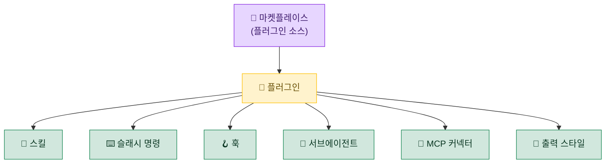

# 🧩 10. 플러그인 & 마켓플레이스

> 훅·스킬·명령·에이전트·MCP 커넥터·출력 스타일을 **한 묶음으로 설치·관리**하는 단위가 플러그인이고, 그 플러그인을 받아오는 저장소가 마켓플레이스입니다.

---

## 📦 개념 — 플러그인 vs 마켓플레이스

| 용어 | 의미 | 비유 |
|---|---|---|
| 🧩 **플러그인(plugin)** | 스킬·슬래시 명령·훅·서브에이전트·MCP 커넥터·출력 스타일 등을 묶어 배포하는 패키지 | 앱 |
| 🏪 **마켓플레이스(marketplace)** | 여러 플러그인을 모아둔 저장소(소스) | 앱 스토어 |
| ⚙️ **활성화(enable)** | 등록된 마켓플레이스에서 특정 플러그인을 켜는 것 | 앱 설치 |

> [!NOTE]
> 마켓플레이스를 **등록**했다고 그 안의 플러그인이 모두 켜지는 것은 아닙니다. 마켓플레이스는 "어디서 가져올지(소스)"를 알려줄 뿐이고, 실제로 동작하려면 플러그인을 **개별적으로 활성화**해야 합니다. 그래서 "소스는 많이 등록해 두되, 켜는 건 필요한 것만"이라는 운영이 가능합니다.

### 플러그인이 제공할 수 있는 것



---

## 🏪 이 셋업에 등록된 마켓플레이스 2개

| 마켓플레이스 | 소스 | 용도 | 활성 플러그인 |
|---|---|---|---|
| 🗿 **caveman** | 커스텀 GitHub(`<github-user>/caveman`) | 토큰 압축 모드 | `caveman@caveman` ✅ |
| 📦 **claude-plugins-official** | 공식 마켓플레이스 | LSP·개발 워크플로·메타·커넥터 등 다수 | (필요 시 on-demand) |

> [!TIP]
> 공식 마켓플레이스는 **"소스로 등록만 해두고, 필요할 때 꺼내 쓰는"** 형태로 운영합니다. 등록 자체는 비용이 없고, 막상 LSP나 특정 커넥터가 필요해졌을 때 곧바로 활성화할 수 있어 편리합니다. 이 셋업에서 상시 켜 둔 플러그인은 caveman 하나뿐입니다.

---

## 📚 공식 마켓플레이스 — 플러그인 군

공식 마켓플레이스(`claude-plugins-official`)에는 다양한 플러그인이 들어 있습니다. 카테고리별로 묶으면 "어떤 일에 무엇을 꺼내면 되는지"가 분명해집니다.

<details>
<summary>🔤 <b>언어 서버(LSP)</b> — 코드 인텔리전스 (펼치기)</summary>

| 플러그인 | 언어 |
|---|---|
| `typescript-lsp` | TypeScript / JavaScript |
| `pyright-lsp` | Python |
| `rust-analyzer-lsp` | Rust |
| `gopls-lsp` | Go |
| `clangd-lsp` | C / C++ |
| `jdtls-lsp` | Java |
| `kotlin-lsp` / `swift-lsp` / `csharp-lsp` / `php-lsp` / `ruby-lsp` / `lua-lsp` | 각 언어 |

> 정의 이동·참조 찾기·타입 인지 등 "코드를 이해하는" 능력을 언어별로 보강합니다.

</details>

<details>
<summary>🛠️ <b>개발 워크플로</b> — 리뷰·기능개발·커밋 (펼치기)</summary>

| 플러그인 | 용도 |
|---|---|
| `code-review` / `pr-review-toolkit` | 코드·PR 리뷰 |
| `feature-dev` | 기능 개발 워크플로 |
| `code-simplifier` / `code-modernization` | 단순화·현대화 리팩터링 |
| `commit-commands` | 커밋 메시지·플로우 |
| `security-guidance` | 보안 점검 가이드 |
| `session-report` | 세션 작업 보고 |

</details>

<details>
<summary>🧰 <b>메타·저작(authoring)</b> — 스킬·플러그인·MCP 만들기 (펼치기)</summary>

| 플러그인 | 용도 |
|---|---|
| `skill-creator` | 새 스킬 제작·평가·최적화 |
| `plugin-dev` | 플러그인 개발 |
| `mcp-server-dev` / `agent-sdk-dev` | MCP 서버·Agent SDK 개발 |
| `claude-md-management` | `CLAUDE.md` 관리 |
| `claude-code-setup` | 초기 셋업 보조 |
| `hookify` | 훅 작성 보조 |

</details>

<details>
<summary>🎨 <b>출력 스타일</b> — 응답 표현 방식 (펼치기)</summary>

| 플러그인 | 효과 |
|---|---|
| `explanatory-output-style` | 설명을 곁들이는 응답 스타일 |
| `learning-output-style` | 학습 친화적 응답 스타일 |

> caveman(토큰 압축)도 같은 "출력 스타일" 계열의 변형으로 이해할 수 있습니다 → [06-caveman.md](06-caveman.md)

</details>

<details>
<summary>🔌 <b>외부 커넥터(MCP)</b> — 서드파티 연동 (펼치기)</summary>

| 커넥터 | 연동 대상 |
|---|---|
| `context7` | 라이브러리 최신 문서 검색 |
| `github` / `gitlab` | 코드 호스팅 |
| `linear` / `asana` | 이슈·프로젝트 관리 |
| `playwright` | 브라우저 자동화 |
| `serena` | 코드 분석 |
| `firebase` / `terraform` / `laravel-boost` | 인프라·프레임워크 |
| `discord` / `telegram` / `imessage` | 메신저 |

> 이들은 MCP 서버 형태로 붙는 커넥터입니다. MCP 전반은 → [05-mcp.md](05-mcp.md)

</details>

> [!NOTE]
> 위 목록은 "이 마켓플레이스에서 **꺼내 쓸 수 있는** 것"이지, "지금 다 켜져 있는" 것이 아닙니다. 실제로 무엇이 켜져 있는지는 → [11-inventory.md](11-inventory.md)의 커버리지 맵에서 확인하세요.

---

## ⚙️ 마켓플레이스 등록 & 플러그인 활성화

### 방법 1 — `settings.json` 직접 편집

```jsonc
{
  // 1) 마켓플레이스(소스) 등록
  "extraKnownMarketplaces": {
    "caveman": {
      "source": { "source": "github", "repo": "<github-user>/caveman" }
    }
  },
  // 2) 그 안의 플러그인 활성화
  "enabledPlugins": {
    "caveman@caveman": true
  }
}
```

> `<플러그인이름>@<마켓플레이스>` 형식으로 활성화합니다.

### 방법 2 — `/plugin` 명령

Claude Code 안에서 `/plugin` 명령으로 마켓플레이스를 추가하고 플러그인을 켜고 끌 수 있습니다. 설정 파일을 직접 만지지 않아도 되는 편한 경로입니다.

---

## ⚠️ 서드파티 플러그인 주의

> [!WARNING]
> 플러그인은 **훅·상태줄 스크립트 등 임의 코드를 실행**할 수 있습니다. 외부(특히 비공식) 플러그인을 활성화하기 전에:
> - 📜 저장소의 **라이선스**가 본인·조직 정책에 맞는지 확인 (코드 비공개 정책이면 GPL·AGPL 계열 주의)
> - 🔎 **소스를 직접 확인**하고, 신뢰할 수 있는 **버전(태그/커밋)을 고정**
> - 🔐 설정에 **토큰·키 같은 실제 값을 직접 적지 않기** (환경변수·placeholder 분리)

---

<div align="center">

[⬅️ 이전: 09. 워크플로](09-workflows.md) · [🏠 목차](../README.md) · [다음: 11. 전체 인벤토리 ➡️](11-inventory.md)

</div>
