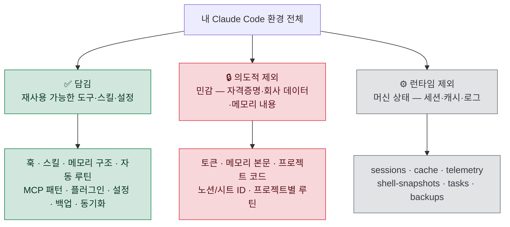

# 🗺️ 11. 전체 인벤토리 & 커버리지 맵

> **"내 셋업 전부가 여기 담겼나?"** 에 대한 정직한 답입니다.
> 환경의 모든 구성요소를 ✅ 담김 / 🔒 의도적 제외(민감) / ⚙️ 런타임 제외(상태) 로 분류해 빠짐없이 매핑합니다.

---

## 🎯 한 줄 요약

이 저장소는 **재사용 가능한 도구·스킬·설정 패턴은 모두 담고**, **개인·회사에 종속된 민감 자산과 머신 런타임 상태는 의도적으로 뺐습니다.** 즉 "방법론과 도구"는 전부, "내 데이터와 비밀"은 전혀.

---

## 📋 `~/.claude/` 구성요소별 커버리지

| 구성요소 | 처리 | 위치 / 사유 |
|---|:---:|---|
| `CLAUDE.md` (글로벌 지침) | ✅ 담김 | [examples/CLAUDE.md.example](../examples/CLAUDE.md.example) · [00](00-quickstart.md) |
| `settings.json` | ✅ 담김 | [examples/settings.json](../examples/settings.json) · [07](07-settings-backup.md) |
| `hooks/` (훅 스크립트) | ✅ 담김 | [examples/hooks/](../examples/hooks) · [01](01-hooks.md) |
| `skills/` (스킬) | ✅ 담김 | [02](02-skills.md) (목록·기준·제작) |
| `scheduled-tasks/` (자동 루틴) | ✅ 담김 | [examples/scheduled-tasks/](../examples/scheduled-tasks) · [04](04-automation.md) |
| `plugins/` (마켓플레이스) | ✅ 담김 | [10](10-plugins-marketplaces.md) (2개 마켓·플러그인군) |
| `statusLine` (caveman) | ✅ 담김 | [06](06-caveman.md) · [07](07-settings-backup.md) |
| 메모리 **구조/규칙** | ✅ 담김 | [03](03-memory.md) (형식·type·인덱스) |
| 메모리 **본문 내용** | 🔒 제외 | 회사·프로젝트 사실 → 민감 |
| `.credentials.json` | 🔒 제외 | 로그인 토큰 → 절대 공유·커밋 금지 |
| MCP 서버 **목록/원칙** | ✅ 담김 | [05](05-mcp.md) |
| MCP **인증 토큰** | 🔒 제외 | 머신별 발급 자격증명 |
| 프로젝트별 루틴(`*-soak`, `*-digest` 등) | 🔒 제외 | 실제 프로젝트 식별·경로 포함 |
| `.claude.json` | ⚙️ 제외 | 머신별 런타임 상태 |
| `sessions/` · `shell-snapshots/` · `ide/` | ⚙️ 제외 | 세션 런타임 |
| `cache/` · `downloads/` · `telemetry/` | ⚙️ 제외 | 캐시·텔레메트리 |
| `tasks/` · `backups/` · `session-env/` | ⚙️ 제외 | 작업·백업 산출물(머신 로컬) |
| `history.jsonl` | ⚙️ 제외 | 입력 이력 |

---

## 🖥️ `~/Scripts/` (훅·백업 스크립트)

| 파일 | 처리 | 위치 |
|---|:---:|---|
| `guard-dangerous-bash.ps1` | ✅ 담김 | [examples/hooks/](../examples/hooks/guard-dangerous-bash.ps1) |
| `ensure-utf8-bom.ps1` | ✅ 담김 | [examples/hooks/](../examples/hooks/ensure-utf8-bom.ps1) |
| `session-context.ps1` | ✅ 담김 | [examples/hooks/](../examples/hooks/session-context.ps1) |
| `caveman-reinforce-ultra.js` | ✅ 담김 | [examples/hooks/](../examples/hooks/caveman-reinforce-ultra.js) (Node, caveman `ultra` 유지) |
| `backup-claude-settings.ps1` | ✅ 담김 | [examples/](../examples/backup-claude-settings.ps1) |

> [!NOTE]
> 위 스크립트들은 `$env:USERPROFILE` 기준 상대 경로와 `<...>` placeholder만 쓰도록 정리했습니다. 개인 절대 경로·작업명은 모두 치환되어 있어 그대로 복사해도 안전합니다.

---

## 🔄 양 머신 동기화 인프라 (`dotclaude/`)

| 항목 | 처리 | 비고 |
|---|:---:|---|
| 동기화 **패턴·구조** | ✅ 담김 | [08](08-sync-infra.md) (4층 분리·apply 흐름·bootstrap) |
| 동기화 **범위 결정 규칙** | ✅ 담김 | ✅/❌ 표 + "정의는 동기화, 상태는 머신별" |
| 실제 `apply-*` 스크립트 원본 | 🔒 제외 | 개인 저장소 URL·경로 포함 → 패턴만 문서화 |

---

## 🚫 의도적으로 뺀 것 (그리고 왜)

> [!IMPORTANT]
> 아래는 "빠뜨린" 것이 아니라 **공유 목적상 일부러 뺀** 것입니다. 이 저장소의 목적은 *업무에 쓴 도구·방법 공유*이지, *내 데이터·작업물 공개*가 아닙니다.

| 뺀 것 | 이유 |
|---|---|
| 🏢 회사·프로젝트 코드 | 기밀. 이 저장소의 공유 대상이 아님 |
| 🧠 메모리 파일 본문 | 회사·프로젝트 사실 포함 (구조·규칙만 공유) |
| 🔐 자격증명·토큰 | 보안. 머신마다 직접 발급이 정석 |
| 🆔 노션/구글시트 ID, 이메일, 계정명 | 개인·내부 식별자 → placeholder 치환 |
| 📅 프로젝트 종속 자동 루틴 | 실제 경로·KPI·일정 포함 |
| 🗃️ 세션·캐시·로그·백업 산출물 | 머신 런타임 상태 (공유 무의미) |

---

## ✅ 그래서, 전부 담겼나?

> [!TIP]
> **재사용 가능한 모든 것은 담겼습니다.** 누군가 이 저장소만 보고도 훅·스킬·메모리·자동화·MCP·플러그인·설정·백업·동기화 체계를 자기 환경에 그대로 재현할 수 있습니다.
> **개인·회사에 묶인 것은 하나도 담기지 않았습니다.** 토큰·메모리 내용·프로젝트 코드는 설계상 제외됩니다.

새로 추가한 도구·스킬이 생기면 이 인벤토리에 한 줄 추가하는 것으로 "무엇이 공유 범위에 들어왔는지"를 계속 추적할 수 있습니다.

---

[⬅️ 이전: 10. 플러그인 & 마켓플레이스](10-plugins-marketplaces.md) · [🏠 목차](../README.md) · [🏠 메인으로](../README.md)

